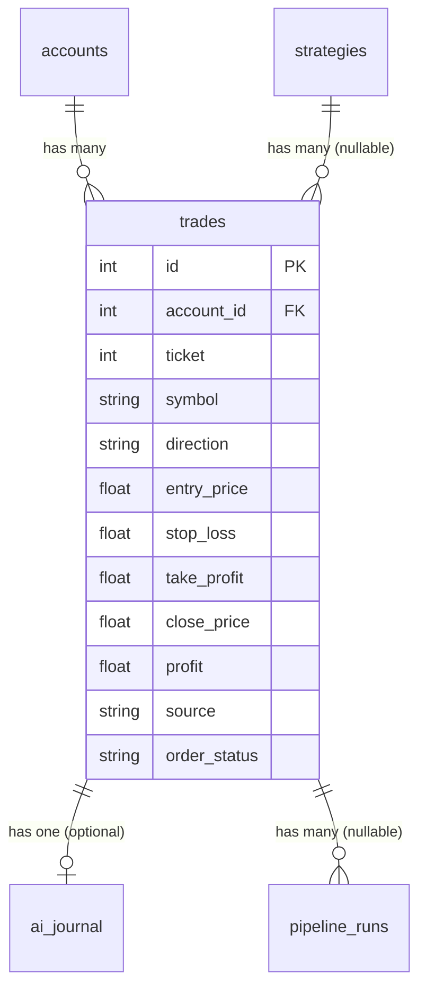

<Callout type="abstract">
Records every trade opened via MT5 — both LLM-driven and manual — with entry/exit prices, P&L, source strategy, and post-trade analysis.
</Callout>

## Table Info

| Property | Value |
| :--- | :--- |
| **Table Name** | `trades` |
| **SQLAlchemy Model** | `backend/db/models.py :: Trade` |
| **Pydantic Schema** | `backend/api/routes/trades.py` |
| **Migration File** | `alembic/versions/` |
| **TimescaleDB Hypertable** | No |
| **Partition Column** | — |


## Columns

| Column | SQLAlchemy Type | Nullable | Default | Description |
| :--- | :--- | :--- | :--- | :--- |
| `id` | `Integer` | No | auto | Primary key |
| `account_id` | `Integer` FK | No | — | FK → `accounts.id` |
| `ticket` | `Integer` | No | — | MT5 order ticket number (indexed) |
| `symbol` | `String(20)` | No | — | Trading pair, e.g. `EURUSD` (indexed) |
| `direction` | `String(4)` | No | — | `BUY` or `SELL` (underlying position direction) |
| `volume` | `Float` | No | — | Trade size in lots |
| `entry_price` | `Float` | No | — | Price at which trade was opened |
| `stop_loss` | `Float` | No | — | Stop-loss price |
| `take_profit` | `Float` | No | — | Take-profit price |
| `close_price` | `Float` | Yes | `null` | Closing price; null while trade is open |
| `profit` | `Float` | Yes | `null` | Realized P&L in account currency; null while open |
| `opened_at` | `DateTime(timezone=True)` | No | — | Trade open timestamp (indexed) |
| `closed_at` | `DateTime(timezone=True)` | Yes | `null` | Trade close timestamp; null while open |
| `source` | `String(100)` | No | `"manual"` | `"manual"` or strategy class name (e.g., `"HarmonicStrategy"`) |
| `is_paper_trade` | `Boolean` | No | `False` | True if paper trade (not live MT5 order) |
| `maintenance_enabled` | `Boolean` | No | `True` | Allow maintenance agent to manage this trade |
| `order_type` | `String(6)` | No | `"market"` | `market` \| `limit` \| `stop` |
| `order_status` | `String(9)` | No | `"filled"` | `pending` \| `filled` \| `cancelled` \| `expired` |
| `strategy_id` | `Integer` FK | Yes | `null` | FK → `strategies.id` (SET NULL on delete) |
| `trade_analysis` | `Text` | Yes | `null` | JSON from post-trade LLM analysis |
| `exclude_from_research` | `Boolean` | No | `False` | If True, skip this trade in research cycle |


## Constraints & Indexes

| Name | Type | Columns | Purpose |
| :--- | :--- | :--- | :--- |
| `pk_trades` | PRIMARY KEY | `id` | Row uniqueness |
| `uq_trade_account_ticket` | UNIQUE | `(account_id, ticket)` | No duplicate MT5 tickets per account |
| `idx_trades_account_id` | INDEX | `account_id` | Fast lookup by account |
| `idx_trades_ticket` | INDEX | `ticket` | Fast lookup by MT5 ticket |
| `idx_trades_symbol` | INDEX | `symbol` | Filter by symbol |
| `idx_trades_opened_at` | INDEX | `opened_at` | Time-range queries |
| `fk_trades_account` | FOREIGN KEY | `account_id → accounts.id` | Referential integrity |
| `fk_trades_strategy` | FOREIGN KEY | `strategy_id → strategies.id` | SET NULL on strategy delete |


## Entity Relationships




## SQLAlchemy Model (reference snapshot)

```python
class Trade(Base):
    __tablename__ = "trades"

    id: Mapped[int] = mapped_column(Integer, primary_key=True)
    account_id: Mapped[int] = mapped_column(Integer, ForeignKey("accounts.id"), index=True)
    ticket: Mapped[int] = mapped_column(Integer, index=True)
    symbol: Mapped[str] = mapped_column(String(20), index=True)
    direction: Mapped[str] = mapped_column(String(4))           # BUY | SELL
    volume: Mapped[float] = mapped_column(Float)
    entry_price: Mapped[float] = mapped_column(Float)
    stop_loss: Mapped[float] = mapped_column(Float)
    take_profit: Mapped[float] = mapped_column(Float)
    close_price: Mapped[float | None] = mapped_column(Float, nullable=True)
    profit: Mapped[float | None] = mapped_column(Float, nullable=True)
    opened_at: Mapped[datetime] = mapped_column(DateTime(timezone=True), index=True)
    closed_at: Mapped[datetime | None] = mapped_column(DateTime(timezone=True), nullable=True)
    source: Mapped[str] = mapped_column(String(100), default="manual")
    is_paper_trade: Mapped[bool] = mapped_column(Boolean, default=False)
    maintenance_enabled: Mapped[bool] = mapped_column(Boolean, default=True)
    order_type: Mapped[str] = mapped_column(String(6), default="market")
    order_status: Mapped[str] = mapped_column(String(9), default="filled")
    strategy_id: Mapped[int | None] = mapped_column(
        Integer, ForeignKey("strategies.id", ondelete="SET NULL"), nullable=True
    )
    trade_analysis: Mapped[str | None] = mapped_column(Text, nullable=True)
    exclude_from_research: Mapped[bool] = mapped_column(Boolean, default=False, server_default="false")

    __table_args__ = (
        UniqueConstraint("account_id", "ticket", name="uq_trade_account_ticket"),
    )
```


## Service Layer

| Layer | File | Purpose |
| :--- | :--- | :--- |
| Router | `backend/api/routes/trades.py` | Trade listing, sync, history |
| Router | `backend/api/routes/accounts.py` | History sync endpoint |
| Scheduler | `backend/services/scheduler.py` | Periodic sync of MT5 trade history |


## 🗂️ Related

| Role | Link |
| :--- | :--- |
| API Endpoint | [API-GET-v1-Trades](API-GET-v1-Trades) |
| Frontend Page | [Page - Analytics](/en/docs/llmsystemtrading/frontend/pages/page-analytics) |
| Related Table | [DB - accounts](/en/docs/llmsystemtrading/database/db-accounts) |
| Related Table | [DB - strategies](/en/docs/llmsystemtrading/database/db-strategies) |
| Related Table | [DB - ai_journal](/en/docs/llmsystemtrading/database/db-ai-journal) |
