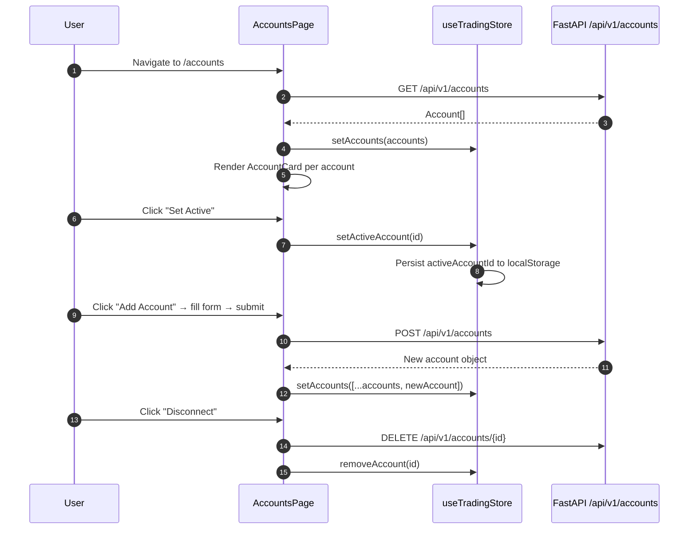

<Callout type="abstract">
Register, view, and manage MT5 trading accounts — select the active account, view live balance/equity/margin, access trade history, and configure per-account settings.
</Callout>

## Route

| Property | Value |
| :--- | :--- |
| **Path** | `/accounts` |
| **File** | `frontend/src/app/accounts/page.tsx` |
| **Auth Required** | No |
| **Layout** | Root layout with sidebar |
| **Dynamic Segment** | None |

**Sub-routes:**
- `/accounts/[id]/history` — Trade history for a specific account


## Component Tree

```
AccountsPage (page.tsx)
├── AppHeader (title="Accounts")
├── Add Account Button → AddAccountDialog
│   └── Form: name, broker, login, password, server, is_live
├── Account List
│   └── AccountCard × N
│       ├── Account name + broker + live/demo badge
│       ├── Balance / Equity / Margin stats
│       ├── Margin Level gauge (colored: red/orange/yellow/green)
│       └── Actions: "Set Active" | "History" link | "Edit" | "Disconnect"
└── (empty state if no accounts registered)
```


## Data Layer

### Server State — Direct fetch

| Call | API | Endpoint | Triggered When |
| :--- | :--- | :--- | :--- |
| Fetch all accounts | `accountsApi.list()` | `GET /api/v1/accounts` | On mount |
| Create account | `AddAccountDialog` submit | `POST /api/v1/accounts` | Form submission |
| Delete account | `AccountCard` disconnect | `DELETE /api/v1/accounts/{id}` | Disconnect button |
| Sync account | `AccountCard` sync | `POST /api/v1/accounts/{id}/sync` | Sync button |

### Global State — Zustand

| Store | Fields Read | Actions Called |
| :--- | :--- | :--- |
| `useTradingStore` | `accounts`, `activeAccountId` | `setAccounts`, `setActiveAccount`, `removeAccount` |

### Local State — `useState`

| Variable | Type | Initial | Purpose |
| :--- | :--- | :--- | :--- |
| (managed by Zustand) | — | — | Account data lives in store |


## Page Lifecycle




## Validation & Conditions

### Render Conditions

| Condition | What Shows |
| :--- | :--- |
| `accounts.length === 0` | Empty state: "No accounts registered — add your first MT5 account" |
| `account.id === activeAccountId` | "Active" badge on card; "Set Active" disabled |
| `margin_level < 100` | Red margin gauge; warning icon |
| `margin_level < 150` | Orange margin gauge |
| `account.is_live` | "Live" badge (red); else "Demo" badge (gray) |

### Add Account Form Validation

| Field | Rules | Error |
| :--- | :--- | :--- |
| `login` | Positive integer, required | "Login must be a valid MT5 number" |
| `password` | Non-empty, required | "Password is required" |
| `server` | Non-empty, required | "Server name is required" |
| `name` | 1–100 chars | "Name is required" |

(Validation is server-side — MT5 verifies credentials on `POST /api/v1/accounts`)


## 🗂️ Related

| Role | Link |
| :--- | :--- |
| Backend API | [API-GET-v1-Accounts](/en/docs/llmsystemtrading/api/accounts/api-get-v1-accounts) |
| Backend API | [API-POST-v1-Accounts](/en/docs/llmsystemtrading/api/accounts/api-post-v1-accounts) |
| Store | [Store - TradingStore](/en/docs/llmsystemtrading/frontend/stores/store-tradingstore) |
| DB Schema | [DB - accounts](/en/docs/llmsystemtrading/database/db-accounts) |
| DB Schema | [DB - trades](/en/docs/llmsystemtrading/database/db-trades) |
