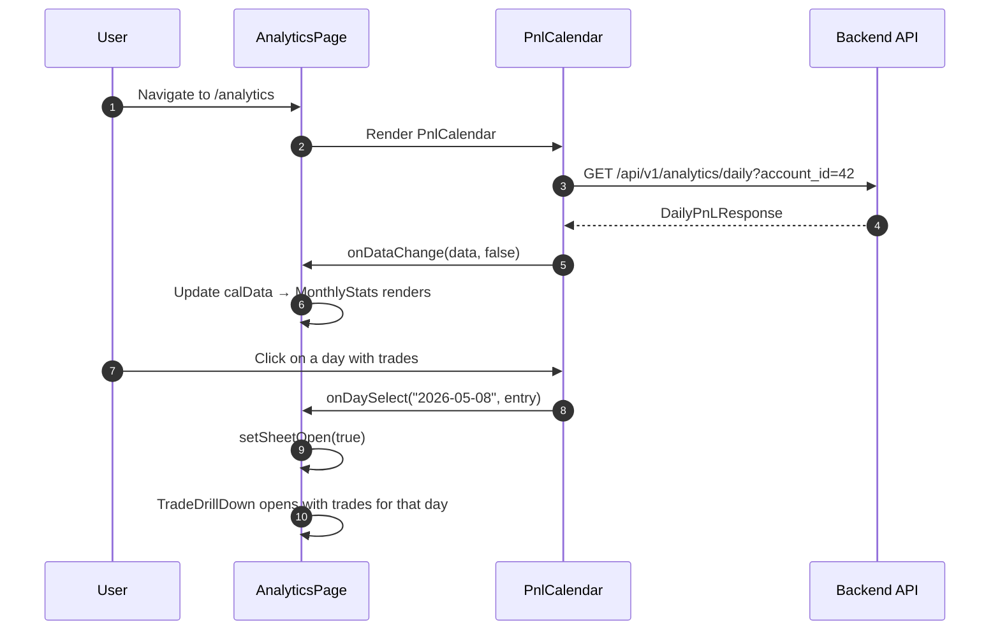

<Callout type="abstract">
Monthly P&L analytics — calendar heatmap showing daily profit/loss, monthly summary stats (win rate, total P&L, best/worst day), and a drill-down sheet for individual day trades.
</Callout>

## Route

| Property | Value |
| :--- | :--- |
| **Path** | `/analytics` |
| **File** | `frontend/src/app/analytics/page.tsx` |
| **Auth Required** | No |
| **Layout** | Root layout with sidebar |
| **Dynamic Segment** | None |


## Component Tree

```
AnalyticsPage (page.tsx)
├── AppHeader (title="Analytics")
├── MonthlyStats (summary cards: total P&L, win rate, trade count, best day)
│   └── Receives calData + calLoading from page state
├── PnlCalendar (main calendar heatmap)
│   └── Fetches GET /api/v1/analytics/daily internally
│   └── onDaySelect → opens TradeDrillDown sheet
│   └── onDataChange → updates calData/calLoading state
└── TradeDrillDown (Sheet component)
    └── Opens when user clicks a day on calendar
    └── Shows trades for selected date
```


## Data Layer

### Server State — Fetched inside child components

| Component | Endpoint | Trigger |
| :--- | :--- | :--- |
| `PnlCalendar` | `GET /api/v1/analytics/daily` | On mount + month navigation |
| `MonthlyStats` | Receives data via `onDataChange` prop | Reactive to `PnlCalendar` fetch |
| `TradeDrillDown` | `GET /api/v1/trades` filtered by date | When sheet opens |

### Local State — `useState`

| Variable | Type | Initial | Purpose |
| :--- | :--- | :--- | :--- |
| `selectedDate` | `string \| null` | `null` | Date clicked on calendar |
| `selectedEntry` | `DailyEntry \| null` | `null` | Entry data for drill-down |
| `sheetOpen` | `boolean` | `false` | Controls TradeDrillDown visibility |
| `calData` | `DailyPnLResponse \| null` | `null` | Calendar data passed to MonthlyStats |
| `calLoading` | `boolean` | `false` | Loading state for MonthlyStats |


## Page Lifecycle




## Validation & Conditions

### Render Conditions

| Condition | What Shows |
| :--- | :--- |
| `calLoading` | Skeleton in MonthlyStats |
| No active account | Calendar shows empty / no-account state |
| Day with `pnl > 0` | Green cell on calendar |
| Day with `pnl < 0` | Red cell on calendar |
| Day with no trades | Gray / neutral cell |
| `sheetOpen` | TradeDrillDown slide-over sheet |


## 🗂️ Related

| Role | Link |
| :--- | :--- |
| Backend API | [API-GET-v1-Analytics](/en/docs/llmsystemtrading/api/analytics/api-get-v1-analytics) |
| DB Schema | [DB - trades](/en/docs/llmsystemtrading/database/db-trades) |
