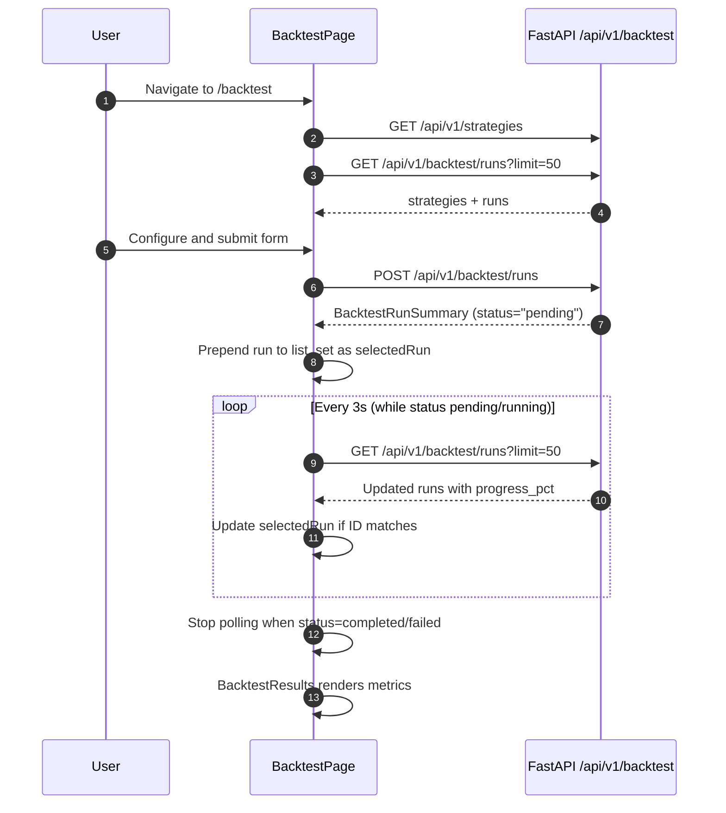

<Callout type="abstract">
Create and monitor strategy backtests — configure parameters, start a run, track progress in real-time via polling, and view performance metrics when complete.
</Callout>

## Route

| Property | Value |
| :--- | :--- |
| **Path** | `/backtest` |
| **File** | `frontend/src/app/backtest/page.tsx` |
| **Auth Required** | No |
| **Layout** | Root layout with sidebar |
| **Dynamic Segment** | None |


## Component Tree

```
BacktestPage (page.tsx)
├── AppHeader (title="Backtest", subtitle="Test strategies on historical OHLCV data")
├── BacktestConfigForm
│   └── StrategySelector (populated from GET /api/v1/strategies)
│   └── Symbol + Timeframe + Date Range inputs
│   └── Initial Balance, Spread, Max LLM Calls inputs
│   └── Submit → POST /api/v1/backtest/runs
├── BacktestRunList
│   └── Run row × N (status badge, progress bar, symbol, timeframe)
│   └── Click to select → shows in BacktestResults
└── BacktestResults (shown when selectedRun !== null)
    └── Metrics cards (Win Rate, Sharpe, Max Drawdown, Profit Factor)
    └── Equity Curve chart
    └── Trade table
```


## Data Layer

### Server State — Direct fetch + polling

| Call | API | Endpoint | Triggered When |
| :--- | :--- | :--- | :--- |
| Fetch strategies | `fetch(${API_BASE_URL}/api/v1/strategies)` | `GET /api/v1/strategies` | On mount |
| Fetch runs | `backtestApi.listRuns({ limit: 50 })` | `GET /api/v1/backtest/runs?limit=50` | On mount + every 3s while active run exists |
| Create run | `BacktestConfigForm` submit | `POST /api/v1/backtest/runs` | Form submission |

### Polling Logic

```typescript
// Poll every 3s only when at least one run is pending/running
useEffect(() => {
  const hasActive = runs.some((r) => r.status === "pending" || r.status === "running");
  if (!hasActive) return;
  const id = setInterval(refreshRuns, 3000);
  return () => clearInterval(id); // cleanup on unmount or when no active runs
}, [runs, refreshRuns]);
```

### Local State — `useState`

| Variable | Type | Initial | Purpose |
| :--- | :--- | :--- | :--- |
| `runs` | `BacktestRunSummary[]` | `[]` | All recent backtest runs (last 50) |
| `selectedRun` | `BacktestRunSummary \| null` | `null` | Currently viewed run in BacktestResults |
| `strategies` | `StrategyItem[]` | `[]` | Strategy list for form selector |


## Page Lifecycle




## Validation & Conditions

### Render Conditions

| Condition | What Shows |
| :--- | :--- |
| `runs.length === 0` | Empty state in BacktestRunList |
| `run.status === "pending"` | Gray status badge + 0% progress bar |
| `run.status === "running"` | Blue progress bar (animated) |
| `run.status === "completed"` | Green badge + metrics visible |
| `run.status === "failed"` | Red badge + error message |
| `selectedRun === null` | BacktestResults shows placeholder |


## 🗂️ Related

| Role | Link |
| :--- | :--- |
| Backend API | [API-POST-v1-Backtest](API-POST-v1-Backtest) |
| DB Schema | [DB - backtest_runs](/en/docs/llmsystemtrading/database/db-backtest-runs) |
| DB Schema | [DB - strategies](/en/docs/llmsystemtrading/database/db-strategies) |
