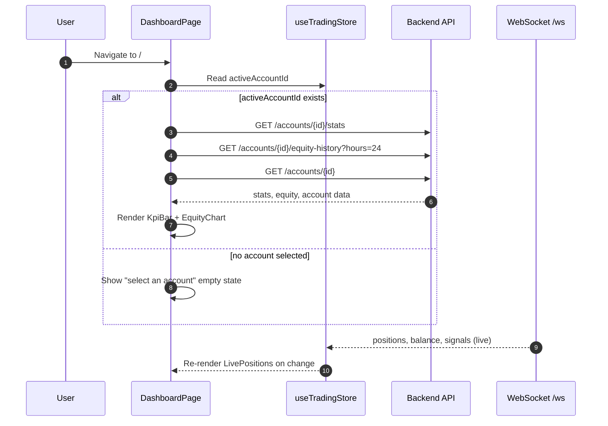

<Callout type="abstract">
Main trading dashboard — displays live equity curve, KPI stats, open positions, recent trades, and kill-switch status for the active MT5 account.
</Callout>

## Route

| Property | Value |
| :--- | :--- |
| **Path** | `/` |
| **File** | `frontend/src/app/page.tsx` |
| **Auth Required** | No |
| **Layout** | Root layout with sidebar |
| **Dynamic Segment** | None |


## Component Tree

```
DashboardPage (page.tsx)
├── AppHeader (title="Dashboard")
├── KillSwitchBanner (shows alert if kill switch active)
├── DashboardProvider (WebSocket handler — feeds live data into store)
│   ├── KpiBar (balance, equity, margin, P&L)
│   ├── EquityChart (equity curve — last 24h by default)
│   ├── LivePositions (open positions table)
│   └── RecentTrades (last 20 trades)
└── Button ("Sync Orders" — manual MT5 sync)
```


## Data Layer

### Server State — Direct fetch (no React Query)

| Call | Hook / API | Endpoint | Triggered When |
| :--- | :--- | :--- | :--- |
| Account stats | `accountsApi.getStats(activeAccountId)` | `GET /api/v1/accounts/{id}/stats` | On mount + when `activeAccountId` changes |
| Equity history | `accountsApi.getEquityHistory(id, hours)` | `GET /api/v1/accounts/{id}/equity-history` | On mount + `equityHours` changes |
| Account detail | `accountsApi.get(activeAccountId)` | `GET /api/v1/accounts/{id}` | On mount (fetches `auto_trade_enabled`) |
| Sync orders | `accountsApi.sync(activeAccountId)` | `POST /api/v1/accounts/{id}/sync` | Manual button click |

### Global State — Zustand

| Store | Fields Read | Actions Called |
| :--- | :--- | :--- |
| `useTradingStore` | `activeAccountId` | `setBalance`, `setOpenPositions` (via WebSocket) |

### Local State — `useState`

| Variable | Type | Initial | Purpose |
| :--- | :--- | :--- | :--- |
| `stats` | `AccountStats \| null` | `null` | KPI data (balance, equity, P&L) |
| `statsLoading` | `boolean` | `false` | Loading state for KpiBar |
| `equityData` | `EquityPoint[]` | `[]` | Chart data points |
| `equityLoading` | `boolean` | `false` | Loading state for EquityChart |
| `equityHours` | `number` | `24` | Time window selector (24h default) |
| `autoTradeEnabled` | `boolean` | `true` | Reflects account `auto_trade_enabled` |
| `syncingOrders` | `boolean` | `false` | Loading state for sync button |


## Page Lifecycle




## Validation & Conditions

### Render Conditions

| Condition | What Shows |
| :--- | :--- |
| `activeAccountId === null` | Empty state: "Select an account to view dashboard" |
| `statsLoading` | Skeleton in KpiBar |
| `equityLoading` | Chart skeleton |
| `killSwitch.is_active` | Red `KillSwitchBanner` at top |
| `!autoTradeEnabled` | Warning badge on KpiBar |
| Equity point already in data | Deduplicated — `handleEquityUpdate` uses `Set` of timestamps |


## 🗂️ Related

| Role | Link |
| :--- | :--- |
| Backend API | [API-GET-v1-Accounts](/en/docs/llmsystemtrading/api/accounts/api-get-v1-accounts) |
| Store | [Store - TradingStore](/en/docs/llmsystemtrading/frontend/stores/store-tradingstore) |
| DB Schema | [DB - accounts](/en/docs/llmsystemtrading/database/db-accounts) |
| DB Schema | [DB - trades](/en/docs/llmsystemtrading/database/db-trades) |
