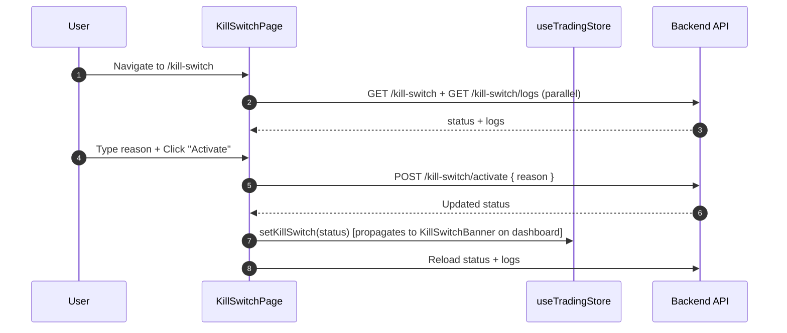

<Callout type="abstract">
Emergency trading halt panel — shows current kill-switch status (active/inactive), provides activate/deactivate controls with a required reason field, and displays the audit log of all previous activations.
</Callout>

## Route

| Property | Value |
| :--- | :--- |
| **Path** | `/kill-switch` |
| **File** | `frontend/src/app/kill-switch/page.tsx` |
| **Auth Required** | No |
| **Layout** | Root layout with sidebar |
| **Dynamic Segment** | None |


## Component Tree

```
KillSwitchPage (page.tsx)
├── AppHeader (title="Kill Switch")
├── Status Card
│   ├── Status Badge (ACTIVE / INACTIVE)
│   ├── Reason text (if active)
│   └── Activated at timestamp (if active)
├── Control Card
│   ├── Textarea: reason (required for activation)
│   ├── Button: "Activate Kill Switch" (red, disabled if reason empty)
│   └── Button: "Deactivate" (shown only when active)
├── Error Alert (if any API error)
└── Audit Log Table
    └── Columns: Action, Reason, Timestamp
```


## Data Layer

### Server State — Direct fetch

| Call | API | Triggered When |
| :--- | :--- | :--- |
| `killSwitchApi.getStatus()` | `GET /api/v1/kill-switch` | On mount |
| `killSwitchApi.getLogs()` | `GET /api/v1/kill-switch/logs` | On mount |
| `killSwitchApi.activate(reason)` | `POST /api/v1/kill-switch/activate` | Activate button |
| `killSwitchApi.deactivate()` | `POST /api/v1/kill-switch/deactivate` | Deactivate button |

After activate/deactivate: `load()` is called to refresh status + logs.

### Local State — `useState`

| Variable | Type | Initial | Purpose |
| :--- | :--- | :--- | :--- |
| `status` | `KillSwitchStatus \| null` | `null` | Current kill-switch state |
| `logs` | `KillSwitchLog[]` | `[]` | Audit log entries |
| `reason` | `string` | `""` | Activation reason textarea |
| `loading` | `boolean` | `false` | Button loading state |
| `error` | `string \| null` | `null` | Error display |


## Page Lifecycle




## Validation & Conditions

### Render Conditions

| Condition | What Shows |
| :--- | :--- |
| `status.is_active === true` | Red "ACTIVE" badge; deactivate button visible |
| `status.is_active === false` | Green "INACTIVE" badge; activate form visible |
| `reason.trim() === ""` | Activate button disabled |
| `loading === true` | Spinner on active button |
| `error !== null` | Error Alert card below controls |


## 🗂️ Related

| Role | Link |
| :--- | :--- |
| Backend API | [API-Kill-Switch](/en/docs/llmsystemtrading/api/killswitch/api-kill-switch) |
| Store | [Store - TradingStore](/en/docs/llmsystemtrading/frontend/stores/store-tradingstore) |
| Page | [Page - Dashboard](/en/docs/llmsystemtrading/frontend/pages/page-dashboard) (KillSwitchBanner) |
