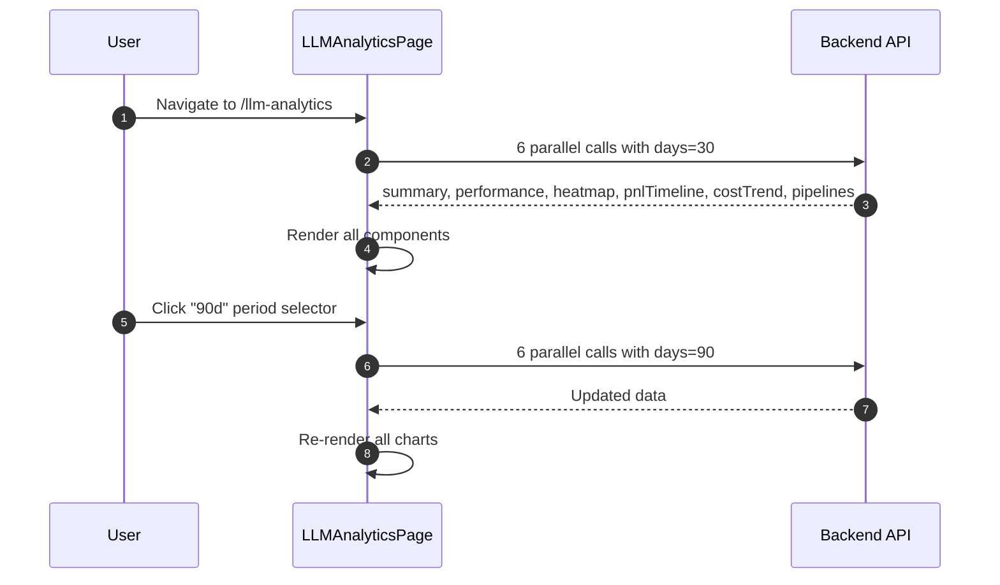

<Callout type="abstract">
Deep analytics on AI trading performance — model win rates, symbol heatmap, cost vs. return scatter, pipeline combinations, and learning insights with 7/30/90 day period selector.
</Callout>

## Route

| Property | Value |
| :--- | :--- |
| **Path** | `/llm-analytics` |
| **File** | `frontend/src/app/llm-analytics/page.tsx` |
| **Auth Required** | No |
| **Layout** | Root layout with sidebar |
| **Dynamic Segment** | None |


## Component Tree

```
LLMAnalyticsPage (page.tsx)
├── AppHeader (title="LLM Analytics", actions: period selector + refresh)
├── SummaryKpiCards (total calls, avg confidence, win rate, total cost)
├── Tabs: "Models" | "Pipelines" | "Learning"
│
├── Tab: Models
│   ├── ModelPerformanceTable (provider, model, calls, win rate, P&L, cost)
│   ├── ModelSymbolHeatmap (symbol × model win rate matrix)
│   ├── CostVsWinrateScatter (cost per call vs. win rate bubble chart)
│   ├── ActionDistributionChart (BUY/SELL/HOLD distribution)
│   └── PnlTimelineChart (P&L over time, colored by model)
│
├── Tab: Pipelines
│   └── PipelineCombinationsTable (agent combos: which combo wins most)
│
└── Tab: Learning
    └── LearningTab (confidence calibration + signal reliability + lessons)
```


## Data Layer

### Server State — `Promise.all` on mount

| State Var | API Call | Endpoint |
| :--- | :--- | :--- |
| `summary` | `llmAnalyticsApi.getSummary(days)` | `GET /api/v1/llm-analytics/summary` |
| `performance` | `llmAnalyticsApi.getModelPerformance(days)` | `GET /api/v1/llm-analytics/model-performance` |
| `heatmap` | `llmAnalyticsApi.getHeatmap(days)` | `GET /api/v1/llm-analytics/heatmap` |
| `pnlTimeline` | `llmAnalyticsApi.getPnlTimeline(days)` | `GET /api/v1/llm-analytics/pnl-timeline` |
| `costTrend` | `llmAnalyticsApi.getCostTrend(days)` | `GET /api/v1/llm-analytics/cost-trend` |
| `pipelines` | `llmAnalyticsApi.getPipelineCombinations(days)` | `GET /api/v1/llm-analytics/pipelines` |

All 6 calls fire in parallel via `Promise.all`. When `days` changes (period selector), `fetchAll(days)` reruns all 6.

### Local State

| Variable | Type | Initial | Description |
| :--- | :--- | :--- | :--- |
| `days` | `number` | `30` | Lookback window: 7, 30, or 90 |
| `tab` | `"Models" \| "Pipelines" \| "Learning"` | `"Models"` | Active tab |
| `loading` | `boolean` | `true` | All-or-nothing loading state |


## Page Lifecycle




## Validation & Conditions

### Render Conditions

| Condition | What Shows |
| :--- | :--- |
| `loading` | Skeleton cards |
| `performance.length === 0` | "No LLM calls in this period" empty state |
| `heatmap.data` all zeros | Neutral gray heatmap |
| LLM fetch error | `console.error` only — no toast |


## 🗂️ Related

| Role | Link |
| :--- | :--- |
| Backend API | [API-LLM-Analytics](/en/docs/llmsystemtrading/api/llmanalytics/api-llm-analytics) |
| DB Schema | [DB - llm_calls](/en/docs/llmsystemtrading/database/db-llm-calls) |
| DB Schema | [DB - ai_journal](/en/docs/llmsystemtrading/database/db-ai-journal) |
