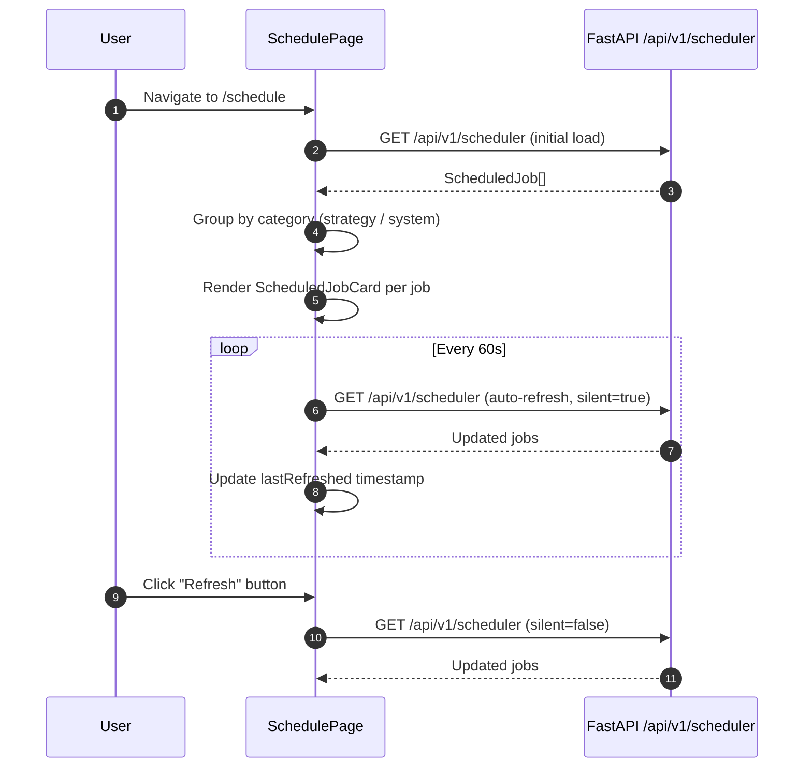

<Callout type="abstract">
Displays all active APScheduler jobs with live countdown timers, grouped by category (strategy vs. system) — and auto-refreshes every 60 seconds.
</Callout>

## Route

| Property | Value |
| :--- | :--- |
| **Path** | `/schedule` |
| **File** | `frontend/src/app/schedule/page.tsx` |
| **Auth Required** | No |
| **Layout** | Root layout with sidebar |
| **Dynamic Segment** | None |


## Component Tree

```
SchedulePage (page.tsx)
├── AppHeader (title="Scheduled Tasks", subtitle="All active APScheduler jobs with live countdowns")
├── Toolbar Row
│   ├── Job count badge (Timer icon + "{N} jobs registered")
│   ├── Last refreshed time
│   └── Button (Manual refresh with RefreshCw icon)
├── Section: "Strategy Jobs" (category="strategy")
│   └── ScheduledJobCard[] (one per job)
│       └── EmptyGroup (if no strategy jobs)
└── Section: "System Jobs" (category="system")
    └── ScheduledJobCard[] (one per job)
        └── EmptyGroup (if no system jobs)
```


## Data Layer

### Server State — Direct fetch

| Call | API | Endpoint | Triggered When |
| :--- | :--- | :--- | :--- |
| Fetch jobs | `schedulerApi.getJobs()` | `GET /api/v1/scheduler` | On mount (initial) |
| Auto-refresh | `schedulerApi.getJobs()` | `GET /api/v1/scheduler` | Every 60 seconds (`REFRESH_INTERVAL_MS = 60_000`) |
| Manual refresh | `schedulerApi.getJobs()` | `GET /api/v1/scheduler` | Button click (shows `refreshing` spinner) |

### Global State — Zustand

None — this page does not read from `useTradingStore`.

### Local State — `useState`

| Variable | Type | Initial | Purpose |
| :--- | :--- | :--- | :--- |
| `jobs` | `ScheduledJob[]` | `[]` | All scheduled jobs from API |
| `loading` | `boolean` | `true` | Initial load skeleton |
| `error` | `string \| null` | `null` | Error message if fetch fails |
| `lastRefreshed` | `Date \| null` | `null` | Timestamp shown in toolbar |
| `refreshing` | `boolean` | `false` | Spinner during manual refresh |


## Page Lifecycle




## Validation & Conditions

### Render Conditions

| Condition | What Shows |
| :--- | :--- |
| `loading` | Skeleton (not shown explicitly — inferred from component state) |
| `error !== null` | Error message string in UI |
| `strategyJobs.length === 0` | `<EmptyGroup label="Strategy" />` placeholder |
| `systemJobs.length === 0` | `<EmptyGroup label="System" />` placeholder |

### Job Grouping Logic

```typescript
const strategyJobs = jobs.filter((j) => j.category === "strategy");
const systemJobs = jobs.filter((j) => j.category === "system");
```


## 🗂️ Related

| Role | Link |
| :--- | :--- |
| Backend API | [API-GET-v1-Scheduler](/en/docs/llmsystemtrading/api/scheduler/api-get-v1-scheduler) |
| DB Schema | [DB - strategies](/en/docs/llmsystemtrading/database/db-strategies) |
