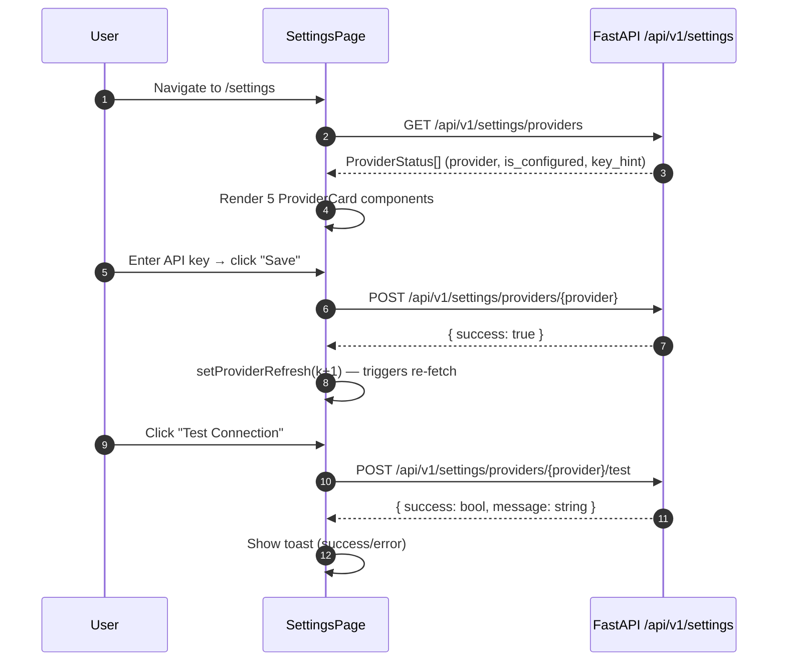

<Callout type="abstract">
System configuration hub — configure LLM provider API keys, assign models to tasks, set maintenance intervals, toggle agent pipeline, manage risk rules, and configure Telegram alerts.
</Callout>

## Route

| Property | Value |
| :--- | :--- |
| **Path** | `/settings` |
| **File** | `frontend/src/app/settings/page.tsx` |
| **Auth Required** | No |
| **Layout** | Root layout with sidebar |
| **Dynamic Segment** | None |


## Component Tree

```
SettingsPage (page.tsx)
├── AppHeader (title="Settings")
└── div (max-w-6xl layout)
    ├── ThemeSection (light/dark/system toggle)
    ├── DisplaySection (UI display preferences)
    ├── Section: "LLM Providers"
    │   └── ProviderCard[] × 5 (openai, gemini, anthropic, openrouter, ollama)
    │       └── Input (API key) + Save + Test buttons per provider
    ├── MaintenanceSection
    │   └── Interval slider + enabled toggle
    ├── AgentPipelineSection
    │   └── enable_agent_pipeline toggle
    │   └── enable_indicator/pattern/trend_agent toggles
    ├── Card: "Risk Manager"
    │   └── RiskManagerSection (drawdown, position limit, rate limit, hedging toggles)
    ├── TelegramSection
    │   └── bot_token input + chat_id + is_enabled toggle
    └── TaskAssignmentsSection
        └── Task→Provider→Model dropdowns (9 tasks)
```


## Data Layer

### Server State — Direct fetch

| Call | API | Endpoint | Triggered When |
| :--- | :--- | :--- | :--- |
| Fetch providers | `settingsApi.listProviders()` | `GET /api/v1/settings/providers` | On mount + after `providerRefresh` counter increments |
| Save provider key | `ProviderCard` save | `POST /api/v1/settings/providers/{provider}` | Per-provider save button |
| Test provider | `ProviderCard` test | `POST /api/v1/settings/providers/{provider}/test` | Per-provider test button |
| Save task assignments | `TaskAssignmentsSection` | `POST /api/v1/settings/task-assignments` | Save assignments button |
| Save maintenance | `MaintenanceSection` | `PUT /api/v1/settings/global` | Toggle/slider change |
| Save risk rules | `RiskManagerSection` | `PUT /api/v1/settings/risk` | Per-rule toggle |
| Save Telegram | `TelegramSection` | `PUT /api/v1/settings/telegram` | Save button |

### Global State — Zustand

None — settings page does not read from `useTradingStore`.

### Local State — `useState`

| Variable | Type | Initial | Purpose |
| :--- | :--- | :--- | :--- |
| `providers` | `ProviderStatus[]` | `[]` | Status of all 5 LLM providers |
| `providerRefresh` | `number` | `0` | Counter — incrementing triggers re-fetch |


## Page Lifecycle




## Validation & Conditions

### Render Conditions

| Condition | What Shows |
| :--- | :--- |
| `providers.length === 0` | Skeleton cards (inferred from ProviderCard) |
| `provider.is_configured` | Green checkmark badge on ProviderCard |
| `provider.key_hint` | Masked key display (e.g., `sk-...abcd`) |

### Form Validation

| Section | Field | Rules |
| :--- | :--- | :--- |
| ProviderCard | API key | Validated server-side — test call returns success/failure |
| TelegramSection | chat_id | Must start with `-100` for groups/channels |
| MaintenanceSection | interval_minutes | Validated as positive integer server-side |


## 🗂️ Related

| Role | Link |
| :--- | :--- |
| Backend API | [API-POST-v1-Settings](/en/docs/llmsystemtrading/api/settings/api-post-v1-settings) |
| DB Schema | [DB - global_settings](/en/docs/llmsystemtrading/database/db-global-settings) |
| DB Schema | [DB - llm_provider_configs](/en/docs/llmsystemtrading/database/db-llm-provider-configs) |
| DB Schema | [DB - task_llm_assignments](/en/docs/llmsystemtrading/database/db-task-llm-assignments) |
| DB Schema | [DB - telegram_settings](/en/docs/llmsystemtrading/database/db-telegram-settings) |
| DB Schema | [DB - risk_settings](/en/docs/llmsystemtrading/database/db-risk-settings) |
