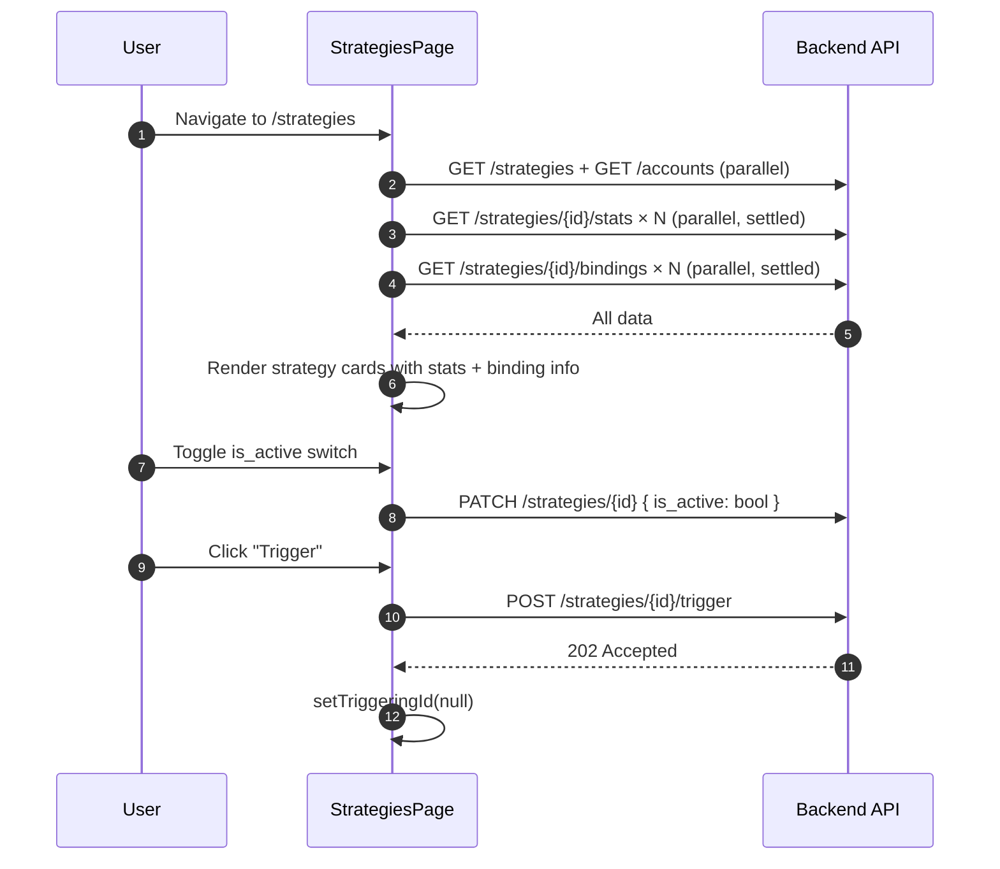

<Callout type="abstract">
Manage trading strategies — view all configured strategies as cards or list, create new ones, edit/delete, toggle active state, bind to accounts, and manually trigger analysis.
</Callout>

## Route

| Property | Value |
| :--- | :--- |
| **Path** | `/strategies` |
| **File** | `frontend/src/app/strategies/page.tsx` |
| **Auth Required** | No |
| **Layout** | Root layout with sidebar |
| **Dynamic Segment** | None |

**Sub-routes:**
- `/strategies/new` — Create strategy form
- `/strategies/[id]` — Strategy detail view
- `/strategies/[id]/edit` — Edit strategy


## Component Tree

```
StrategiesPage (page.tsx)
├── AppHeader (title="Strategies")
├── Toolbar: view mode toggle (grid | list) + "New Strategy" button
├── Tabs: "Strategies" view | "Accounts" view
├── Strategy Cards (grid or list layout)
│   └── StrategyCard × N
│       ├── Name + type badge (config/prompt/code)
│       ├── Execution mode badge (llm_only / multi_agent / ...)
│       ├── Symbols list + timeframe
│       ├── Stats (win rate, total trades, P&L from getStats())
│       ├── Bindings (accounts bound to this strategy)
│       ├── Switch: is_active toggle
│       └── Actions: Edit | Delete | Trigger buttons
└── DeleteDialog (confirm before delete)
```


## Data Layer

### Server State — Direct fetch

| Call | API | Endpoint | Triggered When |
| :--- | :--- | :--- | :--- |
| Fetch strategies | `strategiesApi.list()` | `GET /api/v1/strategies` | On mount |
| Fetch accounts | `accountsApi.list()` | `GET /api/v1/accounts` | On mount (for binding display) |
| Fetch stats | `strategiesApi.getStats(id)` | `GET /api/v1/strategies/{id}/stats` | Per strategy on mount (parallel) |
| Fetch bindings | `strategiesApi.getBindings(id)` | `GET /api/v1/strategies/{id}/bindings` | Per strategy on mount (parallel) |
| Delete | `strategiesApi.delete(id)` | `DELETE /api/v1/strategies/{id}` | Delete button + confirm dialog |
| Trigger | `strategiesApi.trigger(id)` | `POST /api/v1/strategies/{id}/trigger` | Trigger button |

### Local State — `useState`

| Variable | Type | Initial | Purpose |
| :--- | :--- | :--- | :--- |
| `strategies` | `Strategy[]` | `[]` | Full strategy list |
| `accounts` | `Account[]` | `[]` | For binding display |
| `viewMode` | `"strategies" \| "accounts"` | `"strategies"` | Tab state |
| `deletingId` | `number \| null` | `null` | Tracks which strategy is being deleted |
| `triggeringId` | `number \| null` | `null` | Loading state for trigger button |
| `statsMap` | `Record<number, StrategyStats>` | `{}` | Per-strategy stats |
| `bindingsMap` | `Record<number, StrategyBinding[]>` | `{}` | Per-strategy account bindings |


## Page Lifecycle




## Validation & Conditions

### Type Badge Colors

| `strategy_type` / `execution_mode` | Color Class |
| :--- | :--- |
| `config` | `bg-blue-100 text-blue-800` |
| `prompt` | `bg-purple-100 text-purple-800` |
| `code` | `bg-green-100 text-green-800` |
| `llm_only` | `bg-purple-100 text-purple-800` |
| `rule_then_llm` | `bg-blue-100 text-blue-800` |
| `hybrid_validator` | `bg-amber-100 text-amber-800` |
| `multi_agent` | `bg-orange-100 text-orange-800` |

### Render Conditions

| Condition | What Shows |
| :--- | :--- |
| `strategies.length === 0` | Empty state + "Create first strategy" CTA |
| `deletingId === strategy.id` | Loading spinner on delete button |
| `triggeringId === strategy.id` | Loading spinner on trigger button |
| `strategy.is_active === false` | Card grayed out |


## 🗂️ Related

| Role | Link |
| :--- | :--- |
| Backend API | [API-Strategies](/en/docs/llmsystemtrading/api/strategies/api-strategies) |
| DB Schema | [DB - strategies](/en/docs/llmsystemtrading/database/db-strategies) |
| DB Schema | [DB - account_strategy](/en/docs/llmsystemtrading/database/db-account-strategy) |
