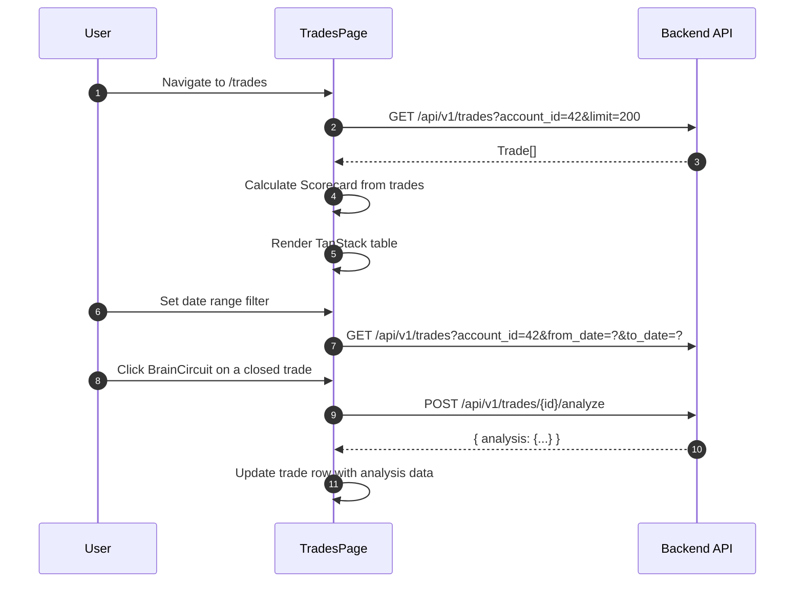

<Callout type="abstract">
Full trade history table for the active account — filter by date range, symbol, open/closed status, and paper trades; view scorecard KPIs; expand rows to see LLM analysis details.
</Callout>

## Route

| Property | Value |
| :--- | :--- |
| **Path** | `/trades` |
| **File** | `frontend/src/app/trades/page.tsx` |
| **Auth Required** | No |
| **Layout** | Root layout with sidebar |
| **Dynamic Segment** | None |


## Component Tree

```
TradesPage (page.tsx)
├── AppHeader (title="Trades")
├── Filters Row
│   ├── DateRangePicker (from_date / to_date via react-day-picker)
│   ├── Symbol filter input
│   ├── Switch: show open trades only
│   ├── Switch: include paper trades
│   └── Button: Refresh
├── Scorecard (calculated from loaded trades)
│   └── Total Trades | Closed | Win Rate | Total P&L
├── TanStack Table (all trades)
│   └── Columns: Symbol, Direction, Entry, SL, TP, Close, Volume, P&L, Status, Source, Opened At
│   └── Expandable row → shows trade_analysis JSON (LLM post-trade review)
│   └── BrainCircuit button → trigger POST /trades/{id}/analyze
└── Pagination
```


## Data Layer

### Server State — Direct fetch

| Call | API | Endpoint | Triggered When |
| :--- | :--- | :--- | :--- |
| Fetch trades | `tradesApi.list(params)` | `GET /api/v1/trades` | On mount + filter changes |
| Analyze trade | `tradesApi.analyze(id)` | `POST /api/v1/trades/{id}/analyze` | BrainCircuit button click |

### Global State — Zustand

| Store | Fields Read | Actions Called |
| :--- | :--- | :--- |
| `useTradingStore` | `activeAccountId` | — |

### Local State — `useState`

| Variable | Type | Initial | Purpose |
| :--- | :--- | :--- | :--- |
| `trades` | `Trade[]` | `[]` | Loaded trades |
| `dateRange` | `DateRange \| undefined` | `undefined` | Date filter from react-day-picker |
| `showOpenOnly` | `boolean` | `false` | Filter open trades |
| `includePaper` | `boolean` | `false` | Include paper trades |
| Filter state (URL sync) | `useSearchParams` | — | Persists filter in URL |


## Page Lifecycle




## Scorecard Calculation (client-side)

```typescript
function Scorecard({ trades }: { trades: Trade[] }) {
  const closed = trades.filter((t) => t.closed_at !== null);
  const wins = closed.filter((t) => (t.profit ?? 0) > 0);
  const totalPnl = closed.reduce((s, t) => s + (t.profit ?? 0), 0);
  const winRate = closed.length > 0 ? (wins.length / closed.length) * 100 : 0;
  // Renders: Total Trades, Closed, Win Rate %, Total P&L
}
```

<Callout type="warning">
The Scorecard is computed from the **loaded** trades, not all trades in the database. If the user applies date filters or the `limit=200` cap is hit, scorecard numbers reflect the filtered/capped dataset only — not lifetime stats.
</Callout>


## Validation & Conditions

### P&L Color Logic

```typescript
const pnlColor = (p: number | null) => {
  if (p == null) return "";
  if (p > 0) return "text-green-600 dark:text-green-400";
  if (p < 0) return "text-red-600 dark:text-red-400";
  return "";
};
```

### Render Conditions

| Condition | What Shows |
| :--- | :--- |
| `trades.length === 0` | Empty state (Inbox icon) |
| `trade.closed_at === null` | Open trade — `close_price` and `profit` show as `—` |
| `trade.trade_analysis !== null` | Expandable row with LLM analysis |
| `trade.is_paper_trade` | "Paper" badge on row |


## 🗂️ Related

| Role | Link |
| :--- | :--- |
| Backend API | [API-Trades](/en/docs/llmsystemtrading/api/trades/api-trades) |
| DB Schema | [DB - trades](/en/docs/llmsystemtrading/database/db-trades) |
| Store | [Store - TradingStore](/en/docs/llmsystemtrading/frontend/stores/store-tradingstore) |
