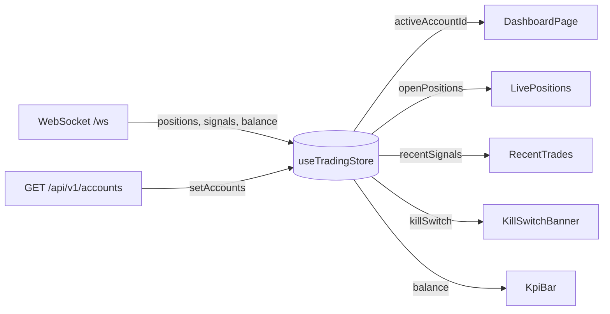

<Callout type="abstract">
Central global state for live trading data — active account selection, open positions, pending orders, recent AI signals, kill-switch status, and broker clock skew. Persists `activeAccountId` to localStorage so account selection survives page refresh.
</Callout>

## File

`frontend/src/hooks/use-trading-store.ts`


## State Shape

```typescript
interface TradingState {
  // — State —
  accounts: Account[];
  activeAccountId: number | null;
  balance: AccountBalance | null;
  openPositions: Position[];
  pendingOrders: PendingOrder[];
  recentSignals: AISignal[];
  killSwitch: KillSwitchStatus;
  brokerClockSkewMs: number;

  // — Actions —
  setAccounts: (accounts: Account[]) => void;
  setActiveAccount: (accountId: number | null) => void;
  updateAccount: (id: number, updates: Partial<Account>) => void;
  removeAccount: (id: number) => void;
  setBalance: (balance: AccountBalance) => void;
  setOpenPositions: (positions: Position[]) => void;
  setPendingOrders: (orders: PendingOrder[]) => void;
  addSignal: (signal: AISignal) => void;
  setKillSwitch: (status: KillSwitchStatus) => void;
  setBrokerClockSkewMs: (skewMs: number) => void;
}
```


## State Fields

| Field | Type | Initial | Description |
| :--- | :--- | :--- | :--- |
| `accounts` | `Account[]` | `[]` | All registered MT5 accounts |
| `activeAccountId` | `number \| null` | `null` | Currently selected account ID (persisted) |
| `balance` | `AccountBalance \| null` | `null` | Live balance for active account |
| `openPositions` | `Position[]` | `[]` | Currently open MT5 positions |
| `pendingOrders` | `PendingOrder[]` | `[]` | Limit/stop orders awaiting fill |
| `recentSignals` | `AISignal[]` | `[]` | Last 50 AI signals (capped via `slice(0, 50)`) |
| `killSwitch` | `KillSwitchStatus` | `{ is_active: false, reason: null, activated_at: null }` | Kill-switch state |
| `brokerClockSkewMs` | `number` | `0` | `brokerNow - Date.now()` offset in ms to correct local clock drift |


## Actions

| Action | Parameters | What it does | Side Effects |
| :--- | :--- | :--- | :--- |
| `setAccounts(a)` | `a: Account[]` | Replaces full accounts list | None |
| `setActiveAccount(id)` | `id: number \| null` | Sets active account; persisted to localStorage | Persisted via `trading-store` key |
| `updateAccount(id, u)` | `id: number, u: Partial<Account>` | Merges updates into matching account | None |
| `removeAccount(id)` | `id: number` | Removes account; clears `activeAccountId` if it was active | None |
| `setBalance(b)` | `b: AccountBalance` | Updates balance for active account | None |
| `setOpenPositions(p)` | `p: Position[]` | Replaces open positions list | None |
| `setPendingOrders(o)` | `o: PendingOrder[]` | Replaces pending orders list | None |
| `addSignal(s)` | `s: AISignal` | Prepends signal; trims to 50 items | None |
| `setKillSwitch(s)` | `s: KillSwitchStatus` | Updates kill-switch state | None |
| `setBrokerClockSkewMs(ms)` | `ms: number` | Updates broker clock offset | None |


## Persistence

| Property | Value |
| :--- | :--- |
| **Persisted** | Yes (partial) |
| **Storage** | `localStorage` |
| **Storage Key** | `trading-store` |
| **Excluded from persist** | `accounts`, `balance`, `openPositions`, `pendingOrders`, `recentSignals`, `killSwitch`, `brokerClockSkewMs` |
| **Included in persist** | `activeAccountId` only |


## Data Flow




## Consumers

| Page / Component | Fields Read | Actions Used |
| :--- | :--- | :--- |
| [Page - Dashboard](/en/docs/llmsystemtrading/frontend/pages/page-dashboard) | `activeAccountId`, `openPositions`, `recentSignals`, `balance`, `killSwitch` | `setBalance`, `setOpenPositions`, `setKillSwitch` |
| [Page - Accounts](/en/docs/llmsystemtrading/frontend/pages/page-accounts) | `accounts`, `activeAccountId` | `setAccounts`, `setActiveAccount`, `removeAccount` |
| `AppHeader` | `activeAccountId`, `accounts` | `setActiveAccount` |
| `KillSwitchBanner` | `killSwitch` | `setKillSwitch` |
| `DashboardProvider` | All live data | All setters (WebSocket handler) |
| `use-websocket.ts` | — | `addSignal`, `setBalance`, `setOpenPositions`, `setBrokerClockSkewMs` |


## 🗂️ Related

| Role | Link |
| :--- | :--- |
| Page | [Page - Dashboard](/en/docs/llmsystemtrading/frontend/pages/page-dashboard) |
| Page | [Page - Accounts](/en/docs/llmsystemtrading/frontend/pages/page-accounts) |
| API | [API-GET-v1-Accounts](/en/docs/llmsystemtrading/api/accounts/api-get-v1-accounts) |
| API | [API-GET-v1-Status](/en/docs/llmsystemtrading/api/status/api-get-v1-status) |
