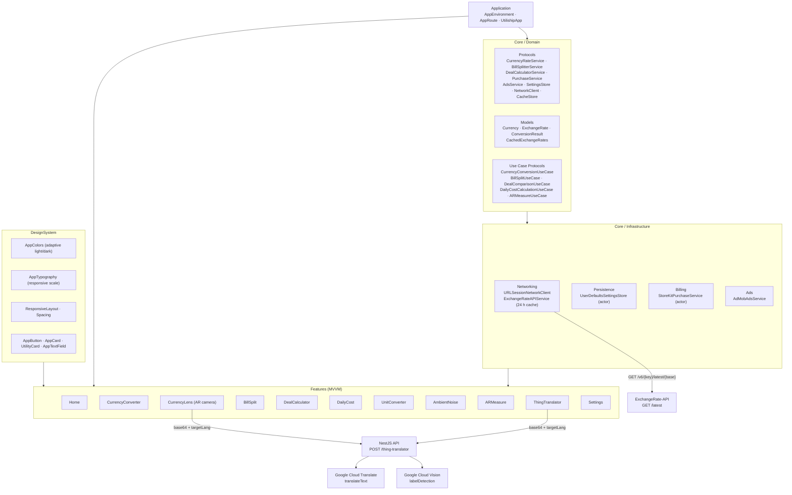

## Overview

Utiliship is an iOS utility suite built on MVVM + Clean Architecture with Swift 6 strict concurrency. A single `AppEnvironment` struct acts as the DI container — created once at app startup, injected into every view via SwiftUI's `.environment` key — so every ViewModel receives its services without global singletons.

A thin NestJS API (`utiliship-api`) handles the two capabilities the device can't do locally: computer vision label detection and machine translation. Every other computation runs fully on-device.

## Layer Diagram



## Layers

### Application (`Utiliship/Application/`)

| File | Role |
|------|------|
| `UtilishipApp.swift` | Entry point; creates `AppEnvironment`, injects via `.environment(\.appEnvironment, env)` |
| `AppEnvironment.swift` | DI container — all service instances live here, created once |
| `AppRoute.swift` | Enum of all navigation destinations; drives `NavigationStack(path:)` in `HomeView` |

### Core / Domain (`Core/Domain/`)

Pure Swift — no framework imports. Defines:
- **Protocols**: all service abstractions, all inherit `Sendable` (enforced by Swift 6)
- **Models**: domain entities as `struct … : Codable, Sendable`
- **Use Case Protocols**: one protocol per feature business operation

### Core / Infrastructure (`Core/Infrastructure/`)

Concrete implementations injected via `AppEnvironment`:

| Implementation | Notes |
|---|---|
| `URLSessionNetworkClient` | Generic `fetch<T: Decodable>(from:as:)` over URLSession |
| `ExchangeRateAPIService` | Fetches `GET /v6/{key}/latest/{base}`; caches `CachedExchangeRates` in UserDefaults; `isValid: Bool { Date() < expiresAt }` |
| `UserDefaultsSettingsStore` | Swift `actor`; all reads/writes isolated |
| `StoreKitPurchaseService` | Swift `actor`; StoreKit 2 subscriptions + one-time IAP |
| `AdMobAdsService` | `GADBannerView` wrapper; placement enum per screen; suppressed for Pro users |

### Features (`Utiliship/Features/`)

Each feature is a self-contained MVVM module:

```
Features/<Name>/
  <Name>View.swift           — SwiftUI body; reads viewModel.state, calls viewModel.action()
  <Name>ViewModel.swift      — @MainActor final class : ObservableObject
                               @Published private(set) var state = State()
  Default<Name>UseCase.swift — implements domain use case protocol
```

### DesignSystem (`Utiliship/DesignSystem/`)

| Component | Key API |
|---|---|
| `AppColors` | `Color.Background.primary`, `Color.Text.primary`, `Color.Border.default`, `Color.Interactive.primary` |
| `AppTypography` | `.font(.headlineLarge)`, `.font(.bodyMedium)`, `.font(.captionSmall)` — auto-scales iPhone ↔ iPad |
| `Spacing` | `Spacing.xl.current`, `Spacing.xs.current` — device-responsive values |
| `ResponsiveLayout` | `DeviceType.current`, `ResponsiveSizeClass`; `.centerOnLargeScreens()`, `.responsivePadding()` |
| `UtilityCard` | Adaptive grid card on `HomeView`; adjusts column count via `AdaptiveGrid` |

## External Services

| Service | Used by | Call |
|---------|---------|------|
| ExchangeRate-API | CurrencyConverter, CurrencyLens | `GET /v6/{key}/latest/{base}`; 24 h UserDefaults cache |
| Google Cloud Vision | NestJS API | `labelDetection` on image buffer |
| Google Cloud Translate | NestJS API | `translateText` to target BCP-47 lang code |
| StoreKit 2 | PurchaseService | In-app subscriptions (Pro tier) |
| AdMob | AdsService | Banner ads per screen; `.withBannerAd(placement:)` modifier |
| ARKit | ARMeasure, CurrencyLens | `ARSession` for distance measurement and camera feed |
