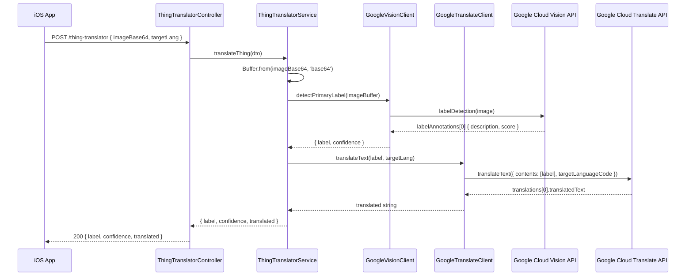

**Method:** `POST`
**Path:** `/thing-translator`
**Controller:** `src/modules/thing-translator/thing-translator.controller.ts`
**Service:** `src/modules/thing-translator/thing-translator.service.ts`

## Purpose

Accepts a base64-encoded image and a target language code, runs Google Cloud Vision label detection on the image to identify the primary object, then returns the detected label translated into the target language. Used by the **Currency Lens** and **Thing Translator** features in the iOS app.

## Request

**Body** (`ThingTranslateRequestDto`):

| Field | Type | Required | Description |
|-------|------|----------|-------------|
| `imageBase64` | `string` | Yes | Base64-encoded image bytes (no data-URL prefix) |
| `targetLang` | `string` | No | BCP-47 language code (e.g. `"th"`, `"ja"`); defaults to `"en"` from config |

**Validation:** `ValidationPipe` with `whitelist: true`, `forbidNonWhitelisted: true`, `transform: true` — applied globally in `main.ts`.

## Response

**200 OK:**

```json
{
  "label": "Coffee cup",
  "confidence": 0.9721,
  "translated": "แก้วกาแฟ"
}
```

| Field | Type | Description |
|-------|------|-------------|
| `label` | `string` | Primary label from Google Vision (English) |
| `confidence` | `number` | Vision confidence score 0–1 |
| `translated` | `string` | `label` translated to `targetLang` |

**Error:** Throws the raw error from Google Cloud SDK — no custom HTTP status mapping; NestJS default exception filter returns 500.

## Flow Diagram



## External Dependencies

| Service | Client | Key call |
|---------|--------|---------|
| Google Cloud Vision | `GoogleVisionClient` (`@google-cloud/vision`) | `client.labelDetection(imageBuffer)` → first annotation |
| Google Cloud Translate | `GoogleTranslateClient` (`@google-cloud/translate`) | `client.translateText({ parent, contents, targetLanguageCode })` |

GCP credentials are resolved via Application Default Credentials (ADC) — no API key in code. `projectId` and `location` read from `ConfigService` (`gcp.projectId`, `gcp.location`).

## Related

- [Architecture](Architecture)
- [Page - Currency Lens](/en/docs/utiliship/frontend/pages/page-currency-lens)
