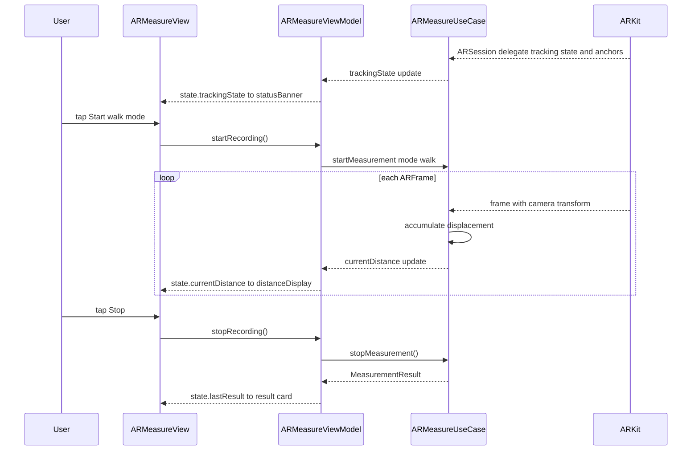

**Screen:** `AppRoute.arMeasure`
**File:** `Utiliship/Features/ARMeasure/ARMeasureView.swift`
**ViewModel:** `Utiliship/Features/ARMeasure/ARMeasureViewModel.swift`
**Use Case:** `Utiliship/Features/ARMeasure/ARMeasureUseCase.swift`

## Purpose

AR-powered distance and surface measurement using ARKit. Two modes: **Walk** (place start/end points by walking the physical path; device tracks cumulative distance) and **Visual** (detect horizontal planes in AR scene, estimate width × height). Results show cm or m depending on magnitude. Users can capture a screenshot and save the measurement.

## Component Tree

```
ARMeasureView
└── ZStack
    ├── ARVisualView          — wraps ARView (RealityKit); full screen
    │   └── ARViewContainer   — UIViewRepresentable bridging ARView
    ├── trackingStatusBanner  — state.trackingStatusText (shown when not ready)
    ├── modePicker            — state.selectedMode (.walk / .visual)
    ├── distanceDisplay       — state.formattedDistance
    ├── planeInfoCard         — state.bestPlane (visual mode only)
    ├── controlRow
    │   ├── startStopButton   — enabled when state.isReadyToStart or state.canStop
    │   ├── resetButton       — enabled when state.canReset
    │   └── captureButton     — enabled when state.canCapture (visual mode)
    └── screenshotConfirmation — shown when state.screenshotSaved
```

## ViewModel State

| Field | Type | Description |
|-------|------|-------------|
| `isARSupported` | `Bool` | False on devices without ARKit |
| `selectedMode` | `MeasurementMode` | `.walk` or `.visual` |
| `isSessionActive` | `Bool` | ARSession is running |
| `isRecording` | `Bool` | Actively accumulating distance (walk mode) |
| `trackingState` | `TrackingState` | `.notAvailable`, `.limited`, `.normal` |
| `currentDistance` | `Double` | Metres accumulated or measured |
| `detectedPlanes` | `[DetectedPlane]` | All planes detected in current AR scene |
| `bestPlane` | `DetectedPlane?` | Largest / most confident plane (visual mode) |
| `lastResult` | `MeasurementResult?` | Completed measurement record |
| `errorMessage` | `String?` | AR session or device error |
| `screenshotSaved` | `Bool` | Triggers confirmation banner |

Computed display helpers: `formattedDistance` (cm / m), `formattedWidth`, `isReadyToStart`, `canStop`, `canReset`, `canCapture`.

## Data Flow



## Related

- [Architecture](Architecture)
- [Page - Home](/en/docs/utiliship/frontend/pages/page-home)
