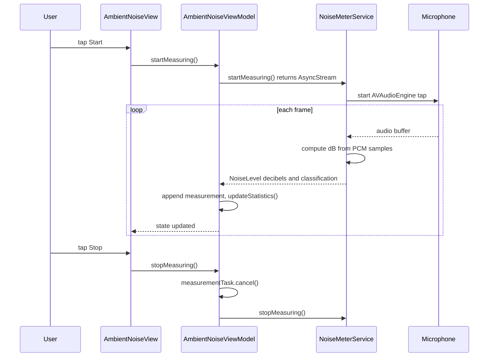

**Screen:** `AppRoute.ambientNoise`
**File:** `Utiliship/Features/AmbientNoise/AmbientNoiseView.swift`
**ViewModel:** `Utiliship/Features/AmbientNoise/AmbientNoiseViewModel.swift`

## Purpose

Real-time ambient noise meter using the device microphone. Displays current dB level, a noise classification badge (Quiet / Moderate / Loud / Very Loud), and running min/max/average statistics. The ViewModel consumes an async stream of `NoiseLevel` values from `NoiseMeterService`.

## Component Tree

```
AmbientNoiseView
└── VStack
    ├── decibelGauge         — large display of state.currentDecibels
    ├── classificationBadge  — state.noiseClassification label + colour
    ├── statisticsRow
    │   ├── minLabel         — state.minDecibels
    │   ├── avgLabel         — state.averageDecibels
    │   └── maxLabel         — state.maxDecibels
    ├── startStopButton      — viewModel.startMeasuring() / stopMeasuring()
    ├── resetButton          — viewModel.resetStatistics()
    └── permissionDeniedCard — shown when state.permissionDenied
    └── .withBannerAd(placement: .ambientNoise)
```

## ViewModel State

| Field | Type | Description |
|-------|------|-------------|
| `currentDecibels` | `Double` | Latest sample from `NoiseMeterService` stream |
| `noiseClassification` | `NoiseClassification` | Derived from current dB level |
| `isMeasuring` | `Bool` | True while `measurementTask` is active |
| `permissionDenied` | `Bool` | True if microphone access was refused |
| `errorMessage` | `String?` | Session or permission error description |
| `minDecibels` | `Double` | Running minimum across current session |
| `maxDecibels` | `Double` | Running maximum |
| `averageDecibels` | `Double` | Mean of all samples this session |

## Data Flow



## Related

- [Architecture](Architecture)
- [Page - Home](/en/docs/utiliship/frontend/pages/page-home)
