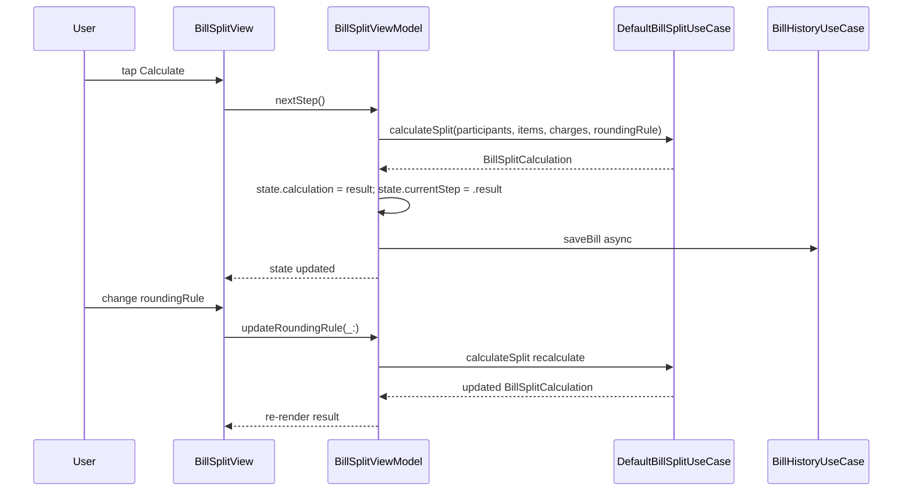

**Screen:** `AppRoute.billSplit`
**File:** `Utiliship/Features/BillSplit/BillSplitView.swift`
**ViewModel:** `Utiliship/Features/BillSplit/BillSplitViewModel.swift`
**Use Case:** `Utiliship/Features/BillSplit/DefaultBillSplitUseCase.swift`

## Purpose

Three-step wizard for splitting a restaurant bill among any number of participants. Step 1 (Setup): add participants and configure service charge / VAT. Step 2 (Items): add line items and assign each to one or more people. Step 3 (Result): view per-person totals with configurable rounding, and share as text. Completed bills are auto-saved to history.

## Component Tree

```
BillSplitView
└── switch state.currentStep
    ├── .setup  → BillSetupView
    │   ├── participantsList   — ForEach state.participants → ParticipantRow
    │   ├── addParticipantRow  — shown when state.isAddingParticipant
    │   ├── chargesSection     — service charge + VAT fields (BillCharges)
    │   └── nextButton         — enabled when state.canProceedToItems
    │
    ├── .items  → BillItemsView
    │   ├── itemsList          — ForEach state.items → BillItemRow
    │   │   └── participantToggleRow per participant
    │   ├── subtotalSummary    — state.itemsSubtotal
    │   └── calculateButton    — enabled when state.canCalculate
    │
    └── .result → BillResultView
        ├── perPersonSection   — ForEach calculation.perPersonAmounts
        ├── roundingPicker     — state.roundingRule
        ├── shareButton        — useCase.generateShareableText
        └── resetButton        — viewModel.reset()
```

## ViewModel State

| Field | Type | Description |
|-------|------|-------------|
| `currencySymbol` | `String` | Symbol from `SettingsStore.preferredCurrency` (default `"฿"`) |
| `currentStep` | `WizardStep` | `.setup`, `.items`, or `.result` |
| `participants` | `[BillParticipant]` | People in the bill; always starts with `.defaultMe` |
| `charges` | `BillCharges` | Service charge percentage + VAT |
| `items` | `[BillItem]` | Line items, each with `participantIds: Set<UUID>` |
| `calculation` | `BillSplitCalculation?` | Result from `DefaultBillSplitUseCase.calculateSplit` |
| `roundingRule` | `RoundingRule` | `.nearest1` default; changing it triggers recalculate |
| `isAddingParticipant` | `Bool` | Shows inline add-participant form |
| `isAddingItem` | `Bool` | Shows inline add-item form |
| `editingParticipant` | `BillParticipant?` | Currently editing participant |
| `editingItem` | `BillItem?` | Currently editing item |
| `errorMessage` | `String?` | Displayed on calculation failure |
| `successMessage` | `String?` | Shown after loading from history |

## Data Flow



## Related

- [Architecture](Architecture)
- [Page - Home](/en/docs/utiliship/frontend/pages/page-home)
