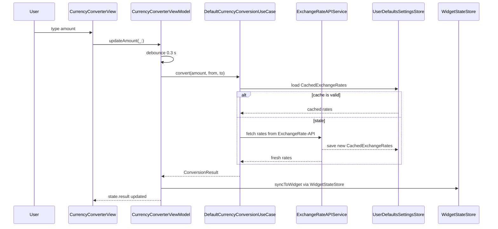

**Screen:** `AppRoute.currencyConverter`
**File:** `Utiliship/Features/CurrencyConverter/CurrencyConverterView.swift`
**ViewModel:** `Utiliship/Features/CurrencyConverter/CurrencyConverterViewModel.swift`
**Use Case:** `Utiliship/Features/CurrencyConverter/DefaultCurrencyConversionUseCase.swift`

## Purpose

Multi-currency converter with real-time rates, offline fallback, preset pairs, and widget sync. The user enters an amount, selects source and one or more target currencies; the ViewModel auto-converts 0.3 s after input stops. Results show exchange rate age and a stale-cache warning.

## Component Tree

```
CurrencyConverterView
├── ScrollView
│   └── VStack
│       ├── amountField          — AppTextField bound to state.amount
│       ├── fromCurrencyPicker   — Button → sheet (currency list)
│       ├── swapButton           — calls viewModel.swapCurrencies()
│       ├── targetCurrencyList   — ForEach state.allTargetCurrencies
│       │   └── resultRow(currency) — shows ConversionResult
│       ├── addTargetButton      — calls viewModel.addTargetCurrency(_:)
│       ├── presetsSection
│       │   └── ForEach state.presets → PresetCard
│       └── cacheStatusBanner    — shown when state.showCacheWarning
├── .withBannerAd(placement: .currencyConverter)
└── .sheet → CurrencyPickerView
```

## ViewModel State

| Field | Type | Description |
|-------|------|-------------|
| `amount` | `String` | Raw text input; filtered to valid decimal |
| `fromCurrency` | `Currency` | Source currency; defaults to `preferredCurrency` from `SettingsStore` |
| `toCurrency` | `Currency` | Primary target; persisted to `UserDefaults` key `"to_currency"` |
| `additionalTargets` | `[Currency]` | Extra targets; persisted to `"additional_targets"` |
| `result` | `ConversionResult?` | Primary conversion result |
| `additionalResults` | `[ConversionResult]` | Results for `additionalTargets` (parallel fetch) |
| `isLoading` | `Bool` | True during `performConversion()` |
| `error` | `String?` | Localised error message |
| `showAllCurrencies` | `Bool` | Toggles popular vs all currencies in picker |
| `presets` | `[CurrencyPairPreset]` | Saved pairs; persisted to `"currency_presets"` |
| `isEditingPresets` | `Bool` | List edit mode for preset reordering |
| `isEditingTargets` | `Bool` | List edit mode for target reordering |

## Data Flow



## Related

- [Architecture](Architecture)
- [Page - Currency Lens](/en/docs/utiliship/frontend/pages/page-currency-lens)
- [Page - Home](/en/docs/utiliship/frontend/pages/page-home)
