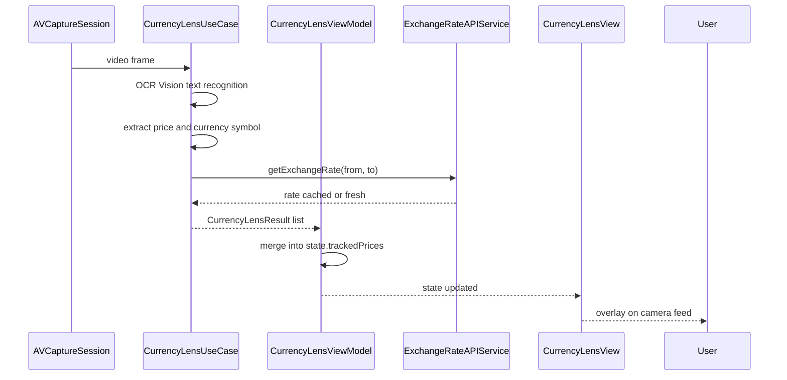

**Screen:** `AppRoute.currencyLens`
**File:** `Utiliship/Features/CurrencyLens/CurrencyLensView.swift`
**ViewModel:** `Utiliship/Features/CurrencyLens/CurrencyLensViewModel.swift`
**Use Case:** `Utiliship/Features/CurrencyLens/CurrencyLensUseCase.swift`

## Purpose

Live AR-style currency overlay. The camera feed runs continuously; the use case scans video frames for price text (OCR), converts each detected amount using cached exchange rates, and renders `TrackedPrice` overlays pinned to their screen position. Users can lock a single overlay, adjust zoom, and toggle flash.

## Component Tree

```
CurrencyLensView
├── ZStack
│   ├── CameraPreviewView(session: state.captureSession)  — full-screen camera
│   │   └── .gesture(MagnificationGesture) → viewModel.setZoom(_:)
│   ├── ForEach state.trackedPrices → PriceOverlayView   — AR overlays
│   └── controlBar (bottom)
│       ├── currencyPickerButton  — shows source/target picker sheet
│       ├── flashButton           — viewModel.toggleFlash()
│       └── lockButton            — viewModel.lockPrice(_:)
├── .withBannerAd(placement: .currencyLens)
└── .sheet(isPresented: $showCurrencyPicker) → currencyPickerSheet
```

## ViewModel State

| Field | Type | Description |
|-------|------|-------------|
| `cameraAuthStatus` | `CameraAuthorizationStatus` | `.notDetermined`, `.authorized`, `.denied` |
| `isCameraActive` | `Bool` | True when `AVCaptureSession` is running |
| `captureSession` | `AVCaptureSession?` | Injected into `CameraPreviewView` |
| `sourceCurrency` | `Currency` | Currency of detected prices (default `.usd`) |
| `targetCurrency` | `Currency?` | Conversion target; nil falls back to base currency |
| `autoDetectCurrency` | `Bool` | Auto-detect currency symbol from OCR text |
| `trackedPrices` | `[TrackedPrice]` | Active AR overlays with smoothed bounding boxes |
| `lockedPrice` | `TrackedPrice?` | User-pinned overlay; pauses detection for that price |
| `isFlashOn` | `Bool` | Torch state |
| `isFlashAvailable` | `Bool` | Device capability |
| `zoomLevel` | `CGFloat` | Current zoom (clamped `minZoom…maxZoom`) |
| `minZoom` / `maxZoom` | `CGFloat` | Device-reported zoom range |
| `error` | `String?` | Camera permission or session error |
| `isProcessing` | `Bool` | True while a frame is being analysed |

## Data Flow



## Related

- [Architecture](Architecture)
- [Page - Currency Converter](/en/docs/utiliship/frontend/pages/page-currency-converter)
- [API-POST-v1-Thing-Translator](/en/docs/utiliship/api/thing-translator/api-post-v1-thing-translator)
