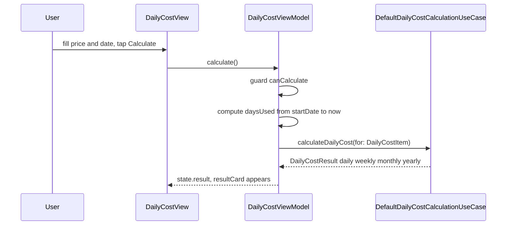

**Screen:** `AppRoute.dailyCost`
**File:** `Utiliship/Features/DailyCost/DailyCostView.swift`
**ViewModel:** `Utiliship/Features/DailyCost/DailyCostViewModel.swift`
**Use Case:** `Utiliship/Features/DailyCost/DefaultDailyCostCalculationUseCase.swift`

## Purpose

Calculates the daily depreciation cost of a purchase. The user enters an optional item name, purchase price, and the date they started using it. The use case divides the total cost by the number of days elapsed since the start date, returning breakdowns per day, week, month, and year.

## Component Tree

```
DailyCostView
└── ScrollView
    └── VStack
        ├── itemNameField      — AppTextField bound to state.itemName (optional)
        ├── purchasePriceField — AppTextField bound to state.purchasePrice
        ├── startDatePicker    — DatePicker bound to state.startDate
        ├── calculateButton    — enabled when state.canCalculate
        ├── resultCard         — shown when state.result != nil
        │   ├── dailyCostRow
        │   ├── weeklyCostRow
        │   ├── monthlyCostRow
        │   └── yearlyCostRow
        └── resetButton
        └── .withBannerAd(placement: .dailyCost)
```

## ViewModel State

| Field | Type | Description |
|-------|------|-------------|
| `itemName` | `String` | Optional label for the item (empty = unnamed) |
| `purchasePrice` | `String` | Raw decimal string input |
| `startDate` | `Date` | Date of purchase; defaults to `Date()` (today) |
| `result` | `DailyCostResult?` | Breakdown returned by `DefaultDailyCostCalculationUseCase` |

Computed properties:
- `isPurchasePriceValid` — `Decimal(string: purchasePrice) != nil && > 0`
- `canCalculate` — `isPurchasePriceValid`

## Data Flow



## Related

- [Architecture](Architecture)
- [Page - Home](/en/docs/utiliship/frontend/pages/page-home)
