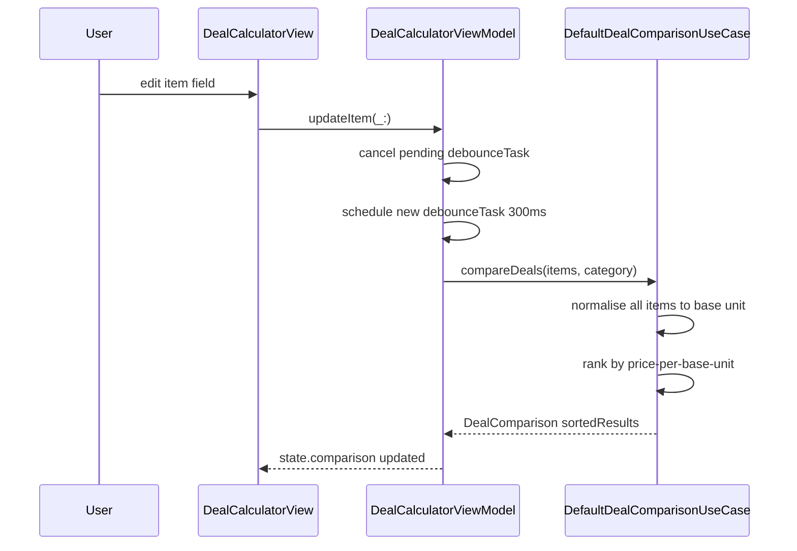

**Screen:** `AppRoute.dealCalculator`
**File:** `Utiliship/Features/DealCalculator/DealCalculatorView.swift`
**ViewModel:** `Utiliship/Features/DealCalculator/DealCalculatorViewModel.swift`
**Use Case:** `Utiliship/Features/DealCalculator/DefaultDealComparisonUseCase.swift`

## Purpose

Compares up to 10 products by price-per-unit to find the best value. Users pick a measurement category (weight, volume, area, count, …), enter each item's name, price, quantity and unit, and the use case ranks them by normalised cost. Comparison is debounced and triggered automatically on every valid input change.

## Component Tree

```
DealCalculatorView
└── ScrollView
    └── VStack
        ├── headerSection         — title + subtitle
        ├── categorySelector      — Picker bound to state.selectedCategory
        ├── errorCard             — shown when state.error != nil
        ├── itemsList             — ForEach state.items → DealItemRow
        │   └── DealItemRow       — name, price, quantity, unit picker, result badge
        ├── addItemButton         — shown when state.canAddMoreItems
        └── clearAllButton        — shown when state.validItemCount >= 2
        └── .withBannerAd(placement: .dealCalculator)
```

## ViewModel State

| Field | Type | Description |
|-------|------|-------------|
| `items` | `[DealItem]` | Up to 10 items; each has name, price, quantity, unit |
| `comparison` | `DealComparison?` | Ranked results from `DefaultDealComparisonUseCase` |
| `selectedCategory` | `MeasurementCategory` | Active unit category (`.weight`, `.volume`, `.area`, `.count`, …) |
| `isLoading` | `Bool` | True during debounced comparison calculation |
| `error` | `String?` | Validation or conversion error message |
| `lastUsedUnit` | `MeasurementUnit?` | Remembered unit for pre-filling new items |
| `baseCurrency` | `Currency` | Display currency symbol from `SettingsStore` |

## Data Flow



## Related

- [Architecture](Architecture)
- [Page - Home](/en/docs/utiliship/frontend/pages/page-home)
