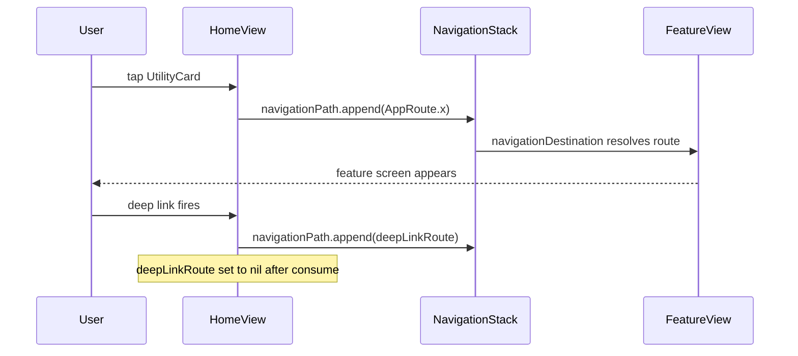

**Screen:** Root screen (no `AppRoute` case — entry point of `NavigationStack`)
**File:** `Utiliship/Features/Home/HomeView.swift`

## Purpose

The app's entry point. Displays the full utility grid and a pinned favourites row so users can reach any tool in one tap. Hosts the `NavigationStack` that drives all feature navigation via `AppRoute`.

## Component Tree

```
HomeView
├── NavigationStack(path: $navigationPath)
│   └── ScrollView
│       └── VStack
│           ├── headerSection          — greeting + Pro badge
│           │   └── .centerOnLargeScreens()
│           ├── utilitiesGrid          — AdaptiveGrid of UtilityCard
│           │   └── .centerOnLargeScreens()
│           └── Spacer
│   └── .withBannerAd(placement: .home)
│   └── .navigationDestination(for: AppRoute.self) { destinationView }
│   └── toolbar → ToolbarItem(.navigationBarTrailing) → settings Button
```

## State

`HomeView` uses `@State` directly (no dedicated ViewModel):

| Field | Type | Description |
|-------|------|-------------|
| `navigationPath` | `NavigationPath` | Drives `NavigationStack`; append `AppRoute` to navigate |
| `favoriteItems` | `[FavoriteItem]` | Pinned tools shown in the favourites strip |
| `currentRoutes` | `[AppRoute]` | Mirrors the live path for guard against duplicate pushes |
| `deepLinkRoute` | `Binding<AppRoute?>` | Deep-link destination injected from parent; consumed on appear |

Environment objects injected:
- `@Environment(\.appEnvironment)` — DI container
- `@EnvironmentObject SettingsViewModel` — Pro status + nav title
- `@EnvironmentObject LocalizationManager` — locale

## Data Flow



## Related

- [Architecture](Architecture)
- [Page - Currency Converter](/en/docs/utiliship/frontend/pages/page-currency-converter)
- [Page - Settings](/en/docs/utiliship/frontend/pages/page-settings)
