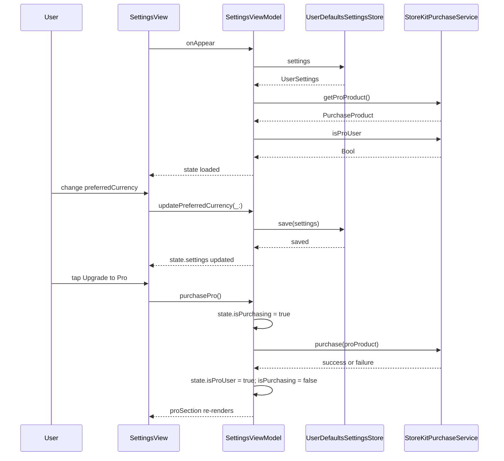

**Screen:** `AppRoute.settings`
**File:** `Utiliship/Features/Settings/SettingsView.swift`
**ViewModel:** `Utiliship/Features/Settings/SettingsViewModel.swift`

## Purpose

User preferences and account screen. Controls preferred currency (used as default across all features), measurement system (metric/imperial for Unit Converter smart defaults), theme, and Pro subscription. Shows device info, app version, and a support link. Pro users can restore purchases.

## Component Tree

```
SettingsView
└── Form / List
    ├── preferenceSection
    │   ├── currencyPicker       — state.settings.preferredCurrency
    │   └── measurementSystemPicker — state.settings.measurementSystem
    ├── appearanceSection
    │   └── themePicker          — state.settings.theme (system/light/dark)
    ├── proSection
    │   ├── proStatusBadge       — state.isProUser
    │   ├── upgradeButton        — viewModel.purchasePro() (shown if not Pro)
    │   └── restorePurchasesButton — viewModel.restorePurchases()
    ├── aboutSection
    │   ├── versionRow           — state.appVersion + state.buildNumber
    │   ├── deviceRow            — state.deviceModel + state.iosVersion
    │   └── supportLink          — opens state.supportFormURL in webView
    └── .sheet → WebView (state.webViewURL)
```

## ViewModel State

| Field | Type | Description |
|-------|------|-------------|
| `settings` | `UserSettings` | Full settings model loaded from `SettingsStore` |
| `isLoading` | `Bool` | True while loading initial settings from `SettingsStore` |
| `error` | `String?` | Settings load or save error |
| `availableCurrencies` | `[Currency]` | All currencies for the picker |
| `appVersion` | `String` | `CFBundleShortVersionString` from `Info.plist` |
| `buildNumber` | `String` | `CFBundleVersion` from `Info.plist` |
| `deviceModel` | `String` | `UIDevice.current.model` |
| `iosVersion` | `String` | `UIDevice.current.systemVersion` |
| `timeZone` | `String` | `TimeZone.current.identifier` |
| `supportFormURL` | `URL?` | Support form URL loaded from config |
| `webViewURL` | `URL?` | URL to open in in-app web sheet |
| `isProUser` | `Bool` | Current Pro entitlement status from `PurchaseService` |
| `proProduct` | `PurchaseProduct?` | StoreKit product info for the Pro upgrade |
| `isLoadingProduct` | `Bool` | True while fetching StoreKit product |
| `isPurchasing` | `Bool` | True during StoreKit purchase flow |
| `restoreResultMessage` | `String?` | Shown after restore attempt |

## Data Flow



## Related

- [Architecture](Architecture)
- [Page - Currency Converter](/en/docs/utiliship/frontend/pages/page-currency-converter)
- [Page - Bill Splitter](/en/docs/utiliship/frontend/pages/page-bill-splitter)
- [DevOps - Utiliship](/en/docs/utiliship/devops/devops-utiliship)
