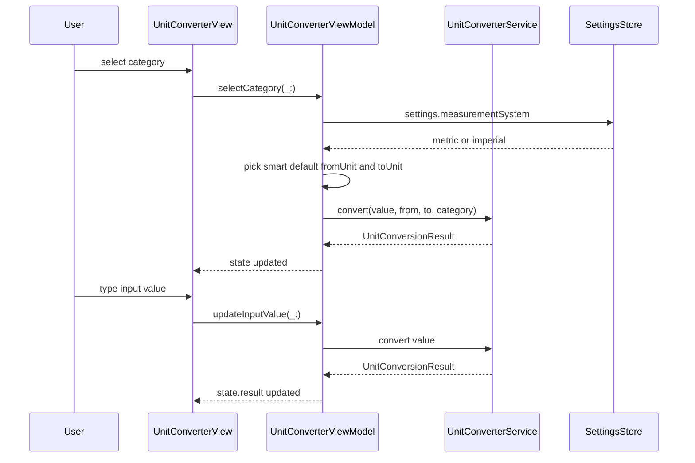

**Screen:** `AppRoute.unitConverter`
**File:** `Utiliship/Features/UnitConverter/UnitConverterView.swift`
**ViewModel:** `Utiliship/Features/UnitConverter/UnitConverterViewModel.swift`

## Purpose

Converts a value between any two units within a selected category (length, weight, temperature, area, volume, speed, data, …). Shows the primary result pair plus an expandable "all conversions" table. The ViewModel persists the last-used category and units across sessions and respects the user's metric/imperial system preference.

## Component Tree

```
UnitConverterView
└── VStack
    ├── categoryPicker          — Picker bound to state.selectedCategory
    ├── inputSection
    │   ├── AppTextField        — state.inputValue
    │   └── fromUnitPicker      — state.fromUnit (filtered to category)
    ├── resultSection
    │   ├── primaryResult       — state.result.convertedValue + state.toUnit
    │   └── toUnitPicker        — state.toUnit
    ├── allConversionsToggle    — toggles state.showAllResults
    └── allConversionsTable     — ForEach state.allConversions (when showAllResults)
    └── .withBannerAd(placement: .unitConverter)
```

## ViewModel State

| Field | Type | Description |
|-------|------|-------------|
| `selectedCategory` | `UnitCategory` | Active conversion domain (length, weight, …) |
| `inputValue` | `String` | Raw decimal string input |
| `fromUnit` | `UnitType` | Source unit (default `.meter` for length) |
| `toUnit` | `UnitType` | Target unit (default `.kilometer`) |
| `result` | `UnitConversionResult?` | Primary conversion result + `allConversions` map |
| `error` | `String?` | Parse or conversion error |
| `showAllResults` | `Bool` | Expands the all-conversions table (default `false`) |
| `lastMeasurementSystem` | `UserSettings.MeasurementSystem?` | Cached preference for smart unit defaults |

## Data Flow



## Related

- [Architecture](Architecture)
- [Page - Home](/en/docs/utiliship/frontend/pages/page-home)
