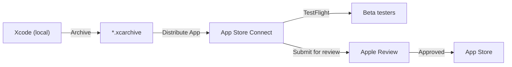
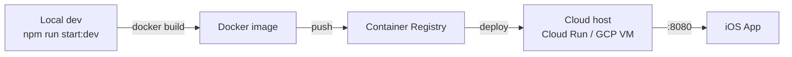

Utiliship has two deployable artefacts: the **iOS app** (distributed via App Store) and the **NestJS API** (containerised, runs on a cloud host).

## iOS App — App Store Deployment

**Bundle ID:** `com.paotharit.utiliship`
**Minimum OS:** iOS 16.6
**Target:** iPhone + iPad (universal)
**Distribution:** Apple App Store ([App Store listing](https://apps.apple.com/us/app/utiliship/id6756077815))
**Widgets:** `UtilishipWidgets` extension bundled in the same Xcode project

### Build & Release Flow



### Build commands

```bash
# Debug build (simulator)
xcodebuild -project Utiliship.xcodeproj \
           -scheme Utiliship \
           -configuration Debug build

# Release build (device)
xcodebuild -project Utiliship.xcodeproj \
           -scheme Utiliship \
           -configuration Release build
```

### Monetisation

| Mechanism | Implementation |
|-----------|---------------|
| In-app purchases (Pro) | StoreKit 2 via `StoreKitPurchaseService` (actor) |
| Banner ads (free tier) | AdMob `GADBannerView` via `AdMobAdsService`; `withBannerAd(placement:)` modifier |
| StoreKit config | `Utiliship.storekit` (local config for testing) |

Pro users have `settingsViewModel.state.isProUser == true`; ads are suppressed and nav title shows "Utiliship Pro".

### Entitlements

| Entitlement | Used by |
|-------------|---------|
| `com.apple.security.application-groups` | Widget data sharing |
| `aps-environment` (push) | `UtilishipWidgetsExtension.entitlements` |

---

## NestJS API — Docker Deployment

**Repo:** `utiliship-api`
**Runtime:** Node.js 20 (slim)
**Port:** `8080` (from `process.env.PORT ?? 8080` in `main.ts`)
**Framework:** NestJS with global `ValidationPipe`

### Dockerfile

```dockerfile
FROM node:20-slim
WORKDIR /usr/src/app
COPY package*.json ./
RUN npm ci
COPY . .
RUN npm run build
ENV NODE_ENV=production
CMD ["node", "dist/main.js"]
```

Build: `npm ci` for reproducible installs, `npm run build` compiles TypeScript to `dist/`.

### Deployment Flow



### Environment Variables

| Variable | Source | Used by |
|----------|--------|---------|
| `PORT` | Host env | `main.ts` listen port |
| `GCP_PROJECT_ID` | Host env / config | `GoogleTranslateClient` |
| `GCP_LOCATION` | Host env / config | `GoogleTranslateClient` |
| `TRANSLATE_DEFAULT_TARGET_LANG` | Host env / config | Fallback language if `targetLang` omitted |
| GCP ADC credentials | Service account / workload identity | Both Google Cloud clients |

### Google Cloud permissions required

| API | Permission |
|-----|-----------|
| Cloud Vision API | `roles/aiplatform.user` or `roles/ml.developer` |
| Cloud Translation API | `roles/cloudtranslate.user` |

---

## Related

- [Architecture](Architecture)
- [API-POST-v1-Thing-Translator](/en/docs/utiliship/api/thing-translator/api-post-v1-thing-translator)
