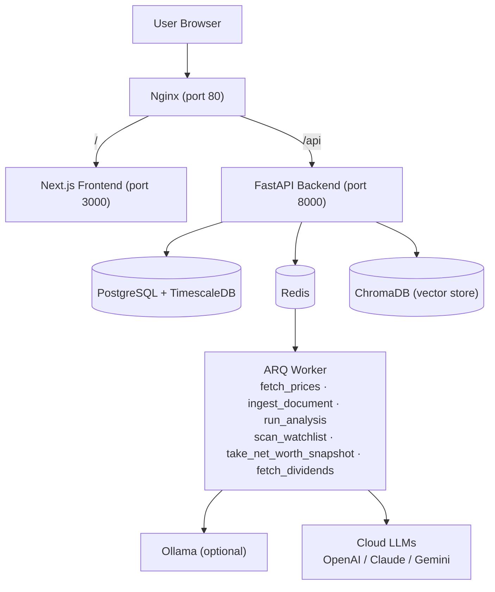
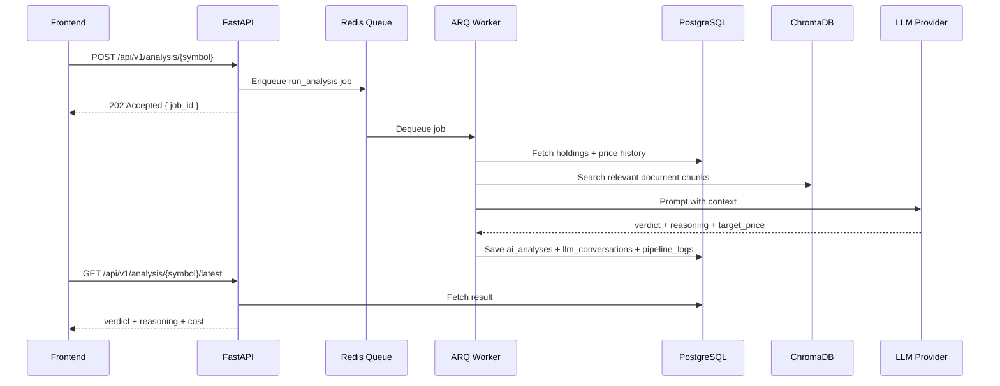
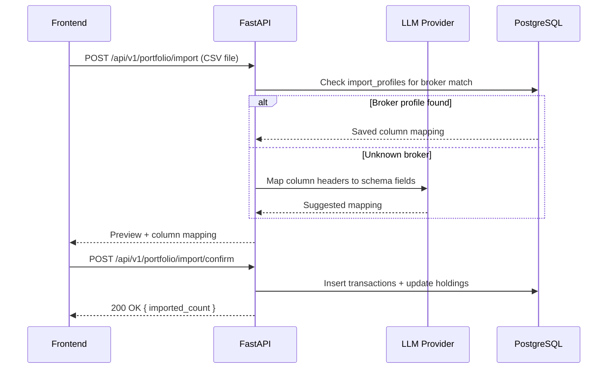

## Architecture Pattern

**Backend + Worker Separation**

FastAPI handles all API requests. A separate ARQ worker handles all background jobs. Both share PostgreSQL/TimescaleDB. Redis acts as the job queue between them.



---

## Services

| Service | Image | Port | Purpose |
|---------|-------|------|---------|
| nginx | nginx:alpine | 80 | Reverse proxy, single entry point |
| frontend | custom | 3000 | Next.js 15 App Router |
| backend | custom | 8000 | FastAPI REST API |
| worker | custom (same as backend) | — | ARQ background jobs |
| postgres | timescale/timescaledb | 5432 | Main database + time-series |
| redis | redis:alpine | 6379 | Job queue + API cache |
| chromadb | chromadb/chroma | 8001 | Embedded document vector store |
| ollama | ollama/ollama | 11434 | Local LLM inference (optional) |

---

## Ollama Setup by Platform

<Callout type="warning">
Docker on Mac cannot access Metal/GPU. Run Ollama **natively** for GPU acceleration:
```bash
brew install ollama
ollama pull mistral:7b-q4
docker compose up -d   # worker connects via host.docker.internal:11434
```
</Callout>

<Callout type="info">
```bash
docker compose --profile local-llm up
```
Requires NVIDIA Container Toolkit. See `docs/gpu-setup.md`.
</Callout>

<Callout type="tip">
Skip Ollama entirely. Configure API key in Settings → LLM Configuration.
</Callout>

---

## Data Flow: AI Analysis



---

## Data Flow: CSV Import



---

## Configuration: Two-Tier

| Tier | Location | What lives here |
|------|----------|----------------|
| Infrastructure | `.env` | DB password, JWT secret, timezone, Ollama host |
| User config | DB (encrypted) | API keys, LLM model, benchmarks, platforms, universe |

API keys encrypted with AES-256, key derived from `JWT_SECRET`.

---

## Monorepo Layout

```
zentri/
├── frontend/
│   ├── Dockerfile
│   ├── app/                  # Next.js App Router pages
│   ├── components/           # shadcn/ui components
│   └── lib/                  # API client, utils
├── backend/
│   ├── Dockerfile
│   ├── app/
│   │   ├── api/              # FastAPI routers (one per domain)
│   │   ├── models/           # SQLAlchemy models
│   │   ├── schemas/          # Pydantic schemas
│   │   ├── services/         # Business logic
│   │   └── core/             # Config, security, DB
│   └── worker/
│       └── jobs/             # ARQ job definitions
├── nginx/
│   └── nginx.conf
├── scripts/
│   ├── backup.sh
│   └── restore.sh
├── docker-compose.yml
├── docker-compose.override.yml
└── .env.example
```

---

## Health Checks & Startup Order

```yaml
postgres:  health → backend depends on
redis:     health → backend + worker depend on
backend:   depends_on postgres (healthy) + redis (healthy)
worker:    depends_on postgres (healthy) + redis (healthy)
frontend:  depends_on backend
nginx:     depends_on frontend + backend
```
