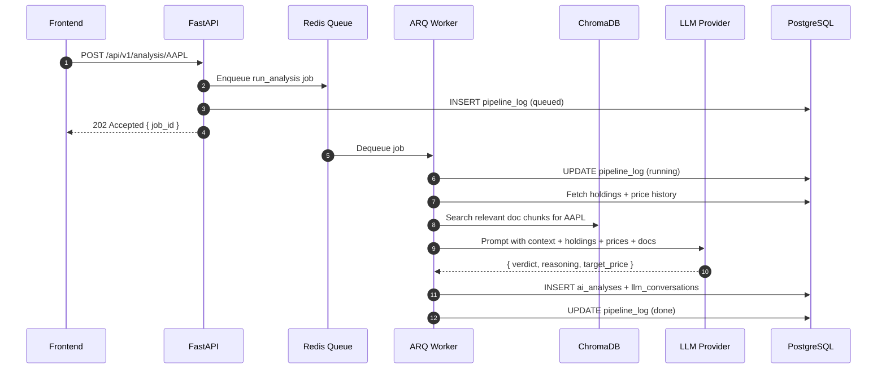

## Overview
<Callout type="abstract">
Triggers a BUY/SELL/HOLD analysis for a specific asset. The job is queued in Redis and processed by the ARQ worker asynchronously. Returns a job_id immediately so the frontend can poll for completion via the pipeline stream.
</Callout>

## 🔒 Authentication
- **Mechanism:** Bearer JWT

## 🛠️ Technical Specification

### Request
| Parameter | Location | Type | Required | Description |
| :--- | :--- | :--- | :--- | :--- |
| `Authorization` | Header | String | Yes | `Bearer {access_token}` |
| `symbol` | Path | String | Yes | Asset symbol e.g. `AAPL`, `BTC` |
| `depth` | Body | String | No | `quick` (local LLM) or `deep` (cloud LLM). Default: `deep` |

### Mermaid Logic



### 📦 Request Body

```json
{
  "depth": "deep"
}
```

### 📤 Responses

**202 Accepted**
```json
{
  "job_id": "uuid",
  "status": "queued",
  "message": "Analysis queued. Check /pipeline/stream for progress."
}
```

**401 Unauthorized**

**404 Not Found** — Symbol not in portfolio or watchlist

### 🗂️ Related Files
| Role | Path |
| :--- | :--- |
| Router | `backend/app/api/analysis.py` |
| Worker Job | `backend/worker/jobs/analysis.py` |
| Service | `backend/app/services/analysis.py` |
| Schema | `backend/app/schemas/analysis.py` |
