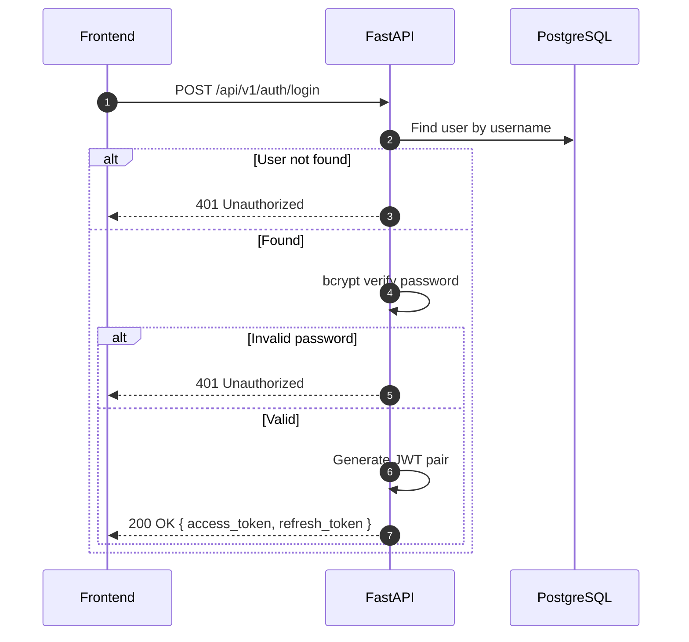

## Overview
<Callout type="abstract">
Authenticates the user with username and password. Returns a JWT access token (short-lived) and refresh token (long-lived) stored as httpOnly cookies.
</Callout>

## 🔒 Authentication
- **Mechanism:** None (this is the auth entry point)

## 🛠️ Technical Specification

### Request
| Parameter | Location | Type | Required | Description |
| :--- | :--- | :--- | :--- | :--- |
| `Content-Type` | Header | String | Yes | `application/json` |
| `username` | Body | String | Yes | |
| `password` | Body | String | Yes | |

### Mermaid Logic



### 📦 Request Body

```json
{
  "username": "paotharit",
  "password": "mypassword123"
}
```

### 📤 Responses

**200 OK**
```json
{
  "access_token": "eyJhbGci...",
  "refresh_token": "eyJhbGci..."
}
```

**401 Unauthorized** — Invalid credentials

### 🗂️ Related Files
| Role | Path |
| :--- | :--- |
| Router | `backend/app/api/auth.py` |
| Service | `backend/app/services/auth.py` |
| Schema | `backend/app/schemas/auth.py` |
