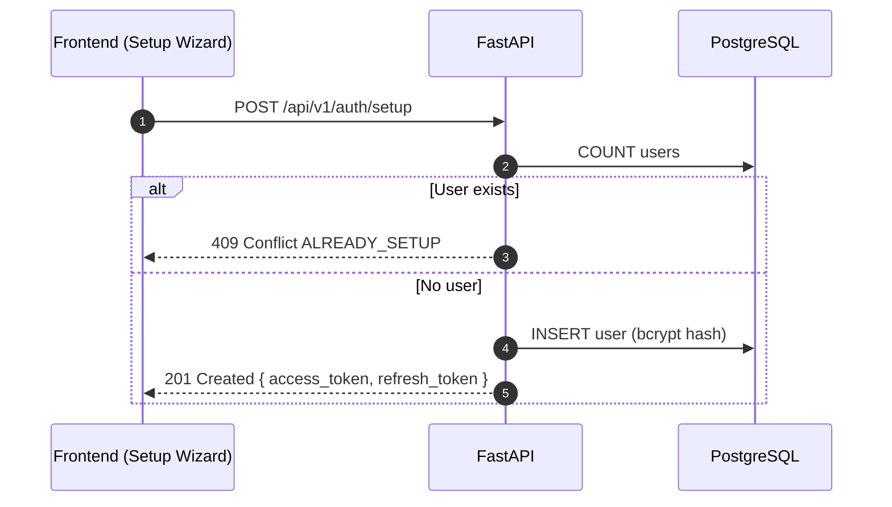

## Overview
<Callout type="abstract">
First-launch account creation. Only available when no user exists in the database. Creates the single admin user, stores bcrypt-hashed password, and returns a JWT token pair. Subsequent calls return 409 if a user already exists.
</Callout>

## 🔒 Authentication
- **Mechanism:** None (this is the first-launch entry point)
- **Guard:** Returns 409 Conflict if any user already exists

## 🛠️ Technical Specification

### Request
| Parameter | Location | Type | Required | Description |
| :--- | :--- | :--- | :--- | :--- |
| `Content-Type` | Header | String | Yes | `application/json` |
| `username` | Body | String | Yes | Desired username |
| `password` | Body | String | Yes | Min 8 characters |

### Mermaid Logic



### 📦 Request Body

```json
{
  "username": "paotharit",
  "password": "mypassword123"
}
```

### 📤 Responses

**201 Created**
```json
{
  "access_token": "eyJhbGci...",
  "refresh_token": "eyJhbGci..."
}
```

**409 Conflict** — User already exists (`ALREADY_SETUP`)

### 🗂️ Related Files
| Role | Path |
| :--- | :--- |
| Router | `backend/app/api/auth.py` |
| Service | `backend/app/services/auth.py` |
| Schema | `backend/app/schemas/auth.py` |
