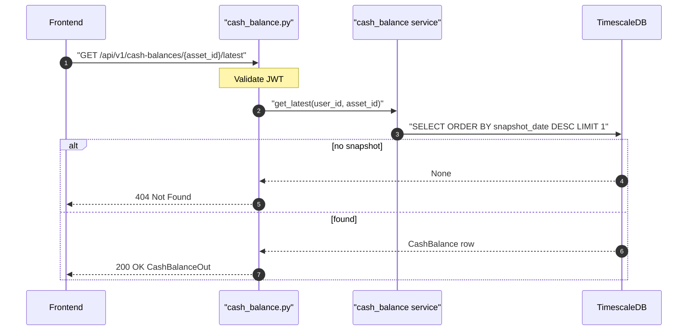

## Overview

Returns the single most recent balance snapshot for a specific cash asset. Returns 404 if no snapshots exist for that asset.

## 🔒 Authentication

| Field | Value |
| :--- | :--- |
| Required | Yes |
| Mechanism | JWT Bearer token via `get_current_user` |

## 🛠️ Technical Specification

### Request

| Field | Value |
| :--- | :--- |
| Method | `GET` |
| Path | `/api/v1/cash-balances/{asset_id}/latest` |

| Path param | Type | Notes |
| :--- | :--- | :--- |
| `asset_id` | UUID | Cash asset ID |

### Logic Flow

### 📤 Responses

**200 OK** — single `CashBalanceOut`

**404 Not Found** — no balance snapshots for this asset

**401 Unauthorized**

### 🗂️ Related Files

| Role | File |
| :--- | :--- |
| Router | `backend/app/api/cash_balance.py` |
| Service | `backend/app/services/cash_balance.py` |

## 🗂️ Related

- [DB - cash_balances](/en/docs/zentri/database/db-cash-balances)
- [API-GET-v1-Cash-Balances-Latest-All](API-GET-v1-Cash-Balances-Latest-All)
- [API-GET-v1-Cash-Balance-History](API-GET-v1-Cash-Balance-History)
