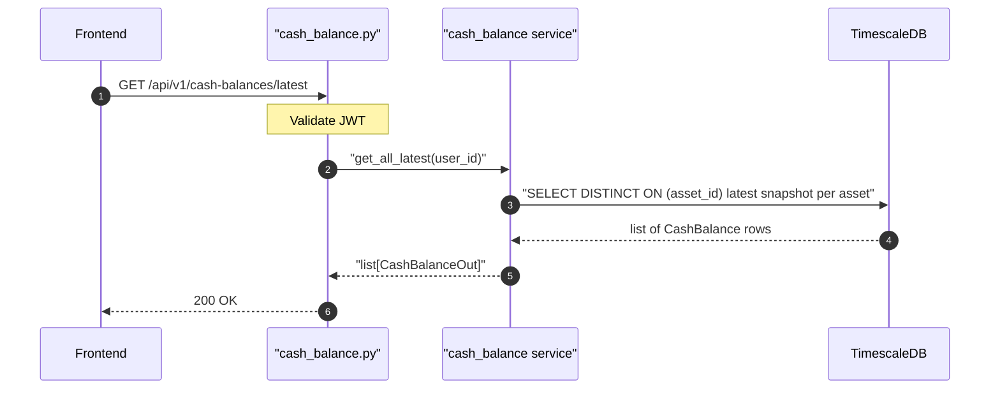

## Overview

Returns the most recent balance snapshot for every cash asset belonging to the authenticated user. Used to display current cash account balances on the Portfolio page.

## 🔒 Authentication

| Field | Value |
| :--- | :--- |
| Required | Yes |
| Mechanism | JWT Bearer token via `get_current_user` |

## 🛠️ Technical Specification

### Request

| Field | Value |
| :--- | :--- |
| Method | `GET` |
| Path | `/api/v1/cash-balances/latest` |
| Query params | None |

### Logic Flow

### 📤 Responses

**200 OK** — list of latest balance per cash asset (may be empty)

**401 Unauthorized**

### 🗂️ Related Files

| Role | File |
| :--- | :--- |
| Router | `backend/app/api/cash_balance.py` |
| Service | `backend/app/services/cash_balance.py` |
| Model | `backend/app/models/cash_balance.py` |

## 🗂️ Related

- [DB - cash_balances](/en/docs/zentri/database/db-cash-balances)
- [API-POST-v1-Cash-Balances](API-POST-v1-Cash-Balances)
- [Component - CashAccountsSection](/en/docs/zentri/frontend/components/component-cashaccountssection)
