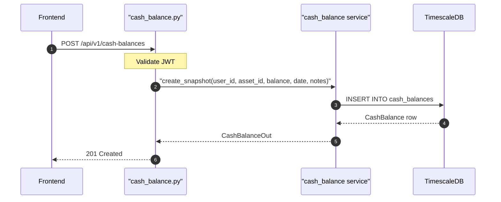

## Overview

Creates a new cash balance snapshot for a specific cash asset. Cash balances are point-in-time snapshots rather than running totals.

## 🔒 Authentication

| Field | Value |
| :--- | :--- |
| Required | Yes |
| Mechanism | JWT Bearer token via `get_current_user` |

## 🛠️ Technical Specification

### Request

| Field | Value |
| :--- | :--- |
| Method | `POST` |
| Path | `/api/v1/cash-balances` |
| Content-Type | `application/json` |

### 📦 Request Body

| Field | Type | Required | Notes |
| :--- | :--- | :--- | :--- |
| `asset_id` | UUID | Yes | Must be a cash-type asset |
| `balance` | number | Yes | Balance amount |
| `snapshot_date` | date | Yes | ISO date of the snapshot |
| `notes` | string | No | Optional memo |

### Logic Flow

### 📤 Responses

**201 Created** — new cash balance snapshot

**401 Unauthorized**

### 🗂️ Related Files

| Role | File |
| :--- | :--- |
| Router | `backend/app/api/cash_balance.py` |
| Service | `backend/app/services/cash_balance.py` |
| Model | `backend/app/models/cash_balance.py` |

## 🗂️ Related

- [DB - cash_balances](/en/docs/zentri/database/db-cash-balances)
- [API-GET-v1-Cash-Balances-Latest-All](API-GET-v1-Cash-Balances-Latest-All)
- [Component - AddCashAccountDialog](Component - AddCashAccountDialog)
