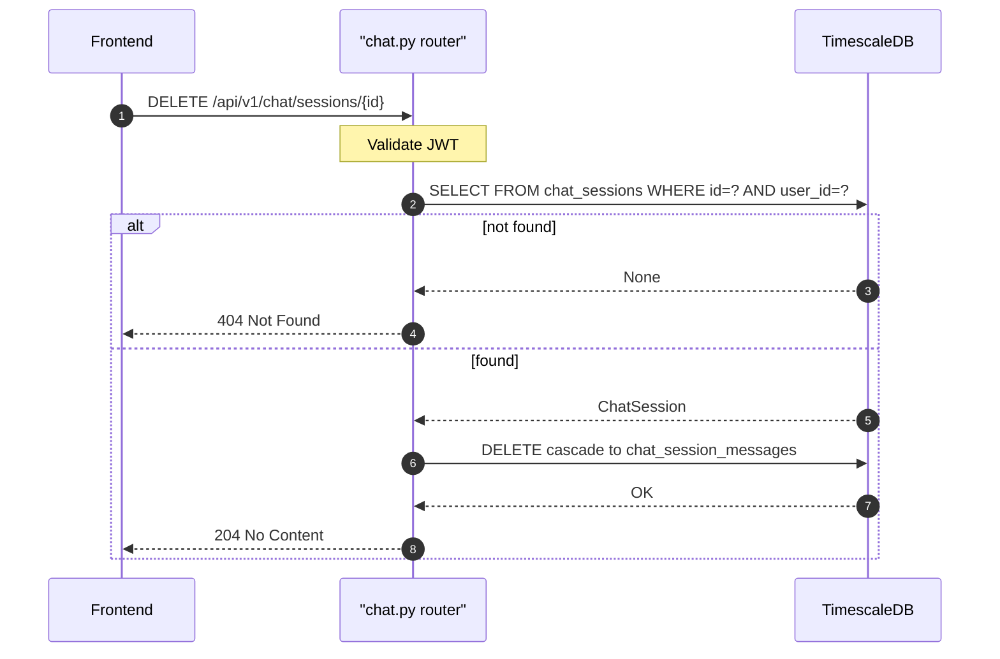

## Overview

Deletes a chat session and all its messages (cascade). Returns 204 No Content. Returns 404 if the session is not found or belongs to another user.

---

## 🔒 Authentication

| Field | Value |
| :--- | :--- |
| Required | Yes |
| Mechanism | JWT Bearer token via `get_current_user` |

---

## 🛠️ Technical Specification

### Request

| Field | Value |
| :--- | :--- |
| Method | `DELETE` |
| Path | `/api/v1/chat/sessions/{session_id}` |
| Request body | None |

| Path param | Type | Notes |
| :--- | :--- | :--- |
| `session_id` | UUID string | Must belong to current user |

### Logic Flow

### 📤 Responses

**204 No Content** — deleted successfully

**404 Not Found** — session not found or belongs to another user

**401 Unauthorized**

### 🗂️ Related Files

| Role | File |
| :--- | :--- |
| Router | `backend/app/api/chat.py` |
| Model | `backend/app/models/chat_session.py` (`ondelete="CASCADE"`) |
| Frontend caller | `frontend/lib/services/chat.ts` → `deleteChatSession(id)` |

---

## 🗂️ Related

- [DB - chat_sessions](/en/docs/zentri/database/db-chat-sessions)
- [API - GET Chat Sessions](/en/docs/zentri/api/chat/api-get-v1-chat-sessions)
- [API - POST Chat Session](/en/docs/zentri/api/chat/api-post-v1-chat-session)
- [Page - Chat](/en/docs/zentri/frontend/pages/page-chat)
