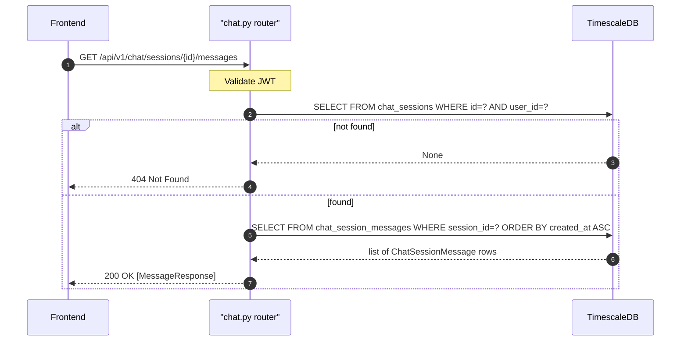

## Overview

Returns all messages for a specific chat session, ordered by `created_at` ascending (oldest first). Verifies session ownership before returning messages — returns 404 if session not found or belongs to another user.

---

## 🔒 Authentication

| Field | Value |
| :--- | :--- |
| Required | Yes |
| Mechanism | JWT Bearer token via `get_current_user` |

---

## 🛠️ Technical Specification

### Request

| Field | Value |
| :--- | :--- |
| Method | `GET` |
| Path | `/api/v1/chat/sessions/{session_id}/messages` |
| Request body | None |

| Path param | Type | Notes |
| :--- | :--- | :--- |
| `session_id` | UUID string | Must belong to current user |

### Logic Flow



### 📤 Responses

**200 OK**
```json
[
  {
    "id": "abc123...",
    "role": "user",
    "content": "What is my portfolio performance?",
    "tokens_in": null,
    "tokens_out": null,
    "cost_usd": null,
    "cost_thb": null,
    "model": null,
    "provider": null,
    "created_at": "2026-05-11T10:01:00Z"
  },
  {
    "id": "def456...",
    "role": "assistant",
    "content": "Your portfolio is up 12% YTD...",
    "tokens_in": 512,
    "tokens_out": 340,
    "cost_usd": 0.003412,
    "cost_thb": 0.118,
    "model": "gpt-4o",
    "provider": "openai",
    "created_at": "2026-05-11T10:01:05Z"
  }
]
```

| Field | Type | Notes |
| :--- | :--- | :--- |
| `id` | string UUID | Message identifier |
| `role` | `"user"` or `"assistant"` | — |
| `content` | string | Raw text; may be JSON for out-of-scope marker |
| `tokens_in/out` | int or null | Null for user-role messages |
| `cost_usd/thb` | number or null | Null for user-role messages |
| `model` | string or null | Null for user-role messages |
| `provider` | string or null | Null for user-role messages |
| `created_at` | ISO 8601 | — |

**404 Not Found**

**401 Unauthorized**

### 🗂️ Related Files

| Role | File |
| :--- | :--- |
| Router | `backend/app/api/chat.py` |
| Models | `backend/app/models/chat_session.py` |
| Frontend caller | `frontend/lib/services/chat.ts` → `getChatMessages(sessionId)` |

---


## 🗂️ Related

- [DB - chat_sessions](/en/docs/zentri/database/db-chat-sessions)
- [API - POST Chat](API - POST Chat)
- [API - GET Chat Sessions](/en/docs/zentri/api/chat/api-get-v1-chat-sessions)
- [Page - Chat](/en/docs/zentri/frontend/pages/page-chat)
