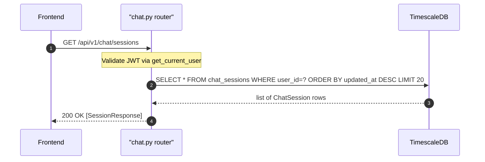

## Overview

Returns the 20 most-recently-active chat sessions for the authenticated user, ordered by `updated_at` descending.

---

## 🔒 Authentication

| Field | Value |
| :--- | :--- |
| Required | Yes |
| Mechanism | JWT Bearer token via `get_current_user` dep (`backend/app/api/deps.py`) |
| Scope | User-scoped — only sessions where `user_id == current_user.id` |

---

## 🛠️ Technical Specification

### Request

| Field | Value |
| :--- | :--- |
| Method | `GET` |
| Path | `/api/v1/chat/sessions` |
| Query params | None |
| Request body | None |

### Logic Flow



### 📤 Responses

**200 OK**
```json
[
  {
    "id": "3fa85f64-5717-4562-b3fc-2c963f66afa6",
    "title": "Portfolio analysis Q2",
    "created_at": "2026-05-11T10:00:00Z",
    "updated_at": "2026-05-11T12:30:00Z"
  }
]
```

| Field | Type | Notes |
| :--- | :--- | :--- |
| `id` | string UUID | Session identifier |
| `title` | string | Max 100 chars in DB; API caps create/rename at 60 |
| `created_at` | ISO 8601 | Session creation timestamp |
| `updated_at` | ISO 8601 | Updated every time a new message is sent |

**401 Unauthorized** — invalid or missing JWT

### 🗂️ Related Files

| Role | File |
| :--- | :--- |
| Router | `backend/app/api/chat.py` |
| Model | `backend/app/models/chat_session.py` |
| Frontend caller | `frontend/lib/services/chat.ts` → `listChatSessions()` |

---


## 🗂️ Related

- [DB - chat_sessions](/en/docs/zentri/database/db-chat-sessions)
- [API - POST Chat Session](/en/docs/zentri/api/chat/api-post-v1-chat-session)
- [API - POST Chat](API - POST Chat)
- [Page - Chat](/en/docs/zentri/frontend/pages/page-chat)
