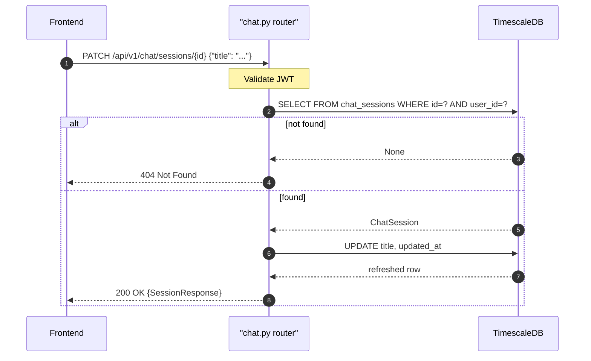

## Overview

Renames a chat session title. Returns the updated session. Title defaults to `"Chat"` if blank; capped at 60 characters. Returns 404 if the session does not exist or belongs to a different user.

---

## 🔒 Authentication

| Field | Value |
| :--- | :--- |
| Required | Yes |
| Mechanism | JWT Bearer token via `get_current_user` |

---

## 🛠️ Technical Specification

### Request

| Field | Value |
| :--- | :--- |
| Method | `PATCH` |
| Path | `/api/v1/chat/sessions/{session_id}` |
| Content-Type | `application/json` |

| Path param | Type | Notes |
| :--- | :--- | :--- |
| `session_id` | UUID string | Must belong to current user |

### 📦 Request Body

```json
{ "title": "Renamed session" }
```

| Field | Type | Required | Notes |
| :--- | :--- | :--- | :--- |
| `title` | string | Yes | Default `"Chat"` if falsy; truncated to 60 chars |

### Logic Flow



### 📤 Responses

**200 OK** — updated session
```json
{
  "id": "3fa85f64-5717-4562-b3fc-2c963f66afa6",
  "title": "Renamed session",
  "created_at": "2026-05-11T10:00:00Z",
  "updated_at": "2026-05-11T13:00:00Z"
}
```

**404 Not Found** — session does not exist or belongs to another user

**401 Unauthorized**

### 🗂️ Related Files

| Role | File |
| :--- | :--- |
| Router | `backend/app/api/chat.py` |
| Model | `backend/app/models/chat_session.py` |
| Frontend caller | `frontend/lib/services/chat.ts` → `renameChatSession(id, title)` |

---


## 🗂️ Related

- [API - GET Chat Sessions](/en/docs/zentri/api/chat/api-get-v1-chat-sessions)
- [API - DELETE Chat Session](/en/docs/zentri/api/chat/api-delete-v1-chat-session)
- [DB - chat_sessions](/en/docs/zentri/database/db-chat-sessions)
- [Page - Chat](/en/docs/zentri/frontend/pages/page-chat)
