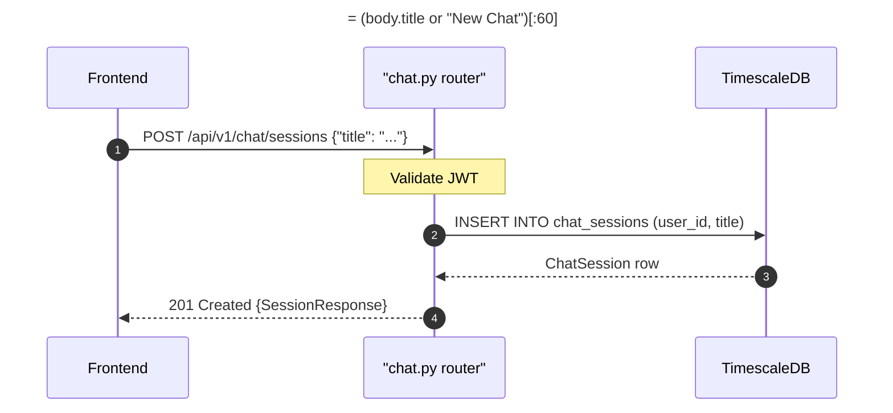

## Overview

Creates a new chat session for the authenticated user. Returns the created session. Title is optional and defaults to `"New Chat"` if omitted; capped at 60 characters.

---

## 🔒 Authentication

| Field | Value |
| :--- | :--- |
| Required | Yes |
| Mechanism | JWT Bearer token via `get_current_user` |

---

## 🛠️ Technical Specification

### Request

| Field | Value |
| :--- | :--- |
| Method | `POST` |
| Path | `/api/v1/chat/sessions` |
| Content-Type | `application/json` |

### 📦 Request Body

```json
{ "title": "My new session" }
```

| Field | Type | Required | Notes |
| :--- | :--- | :--- | :--- |
| `title` | string | No | Default `"New Chat"`; truncated to 60 chars |

### Logic Flow



### 📤 Responses

**201 Created**
```json
{
  "id": "3fa85f64-5717-4562-b3fc-2c963f66afa6",
  "title": "My new session",
  "created_at": "2026-05-11T10:00:00Z",
  "updated_at": "2026-05-11T10:00:00Z"
}
```

**401 Unauthorized** — invalid or missing JWT

### 🗂️ Related Files

| Role | File |
| :--- | :--- |
| Router | `backend/app/api/chat.py` |
| Model | `backend/app/models/chat_session.py` |
| Frontend caller | `frontend/lib/services/chat.ts` → `createChatSession(title)` |

---


## 🗂️ Related

- [DB - chat_sessions](/en/docs/zentri/database/db-chat-sessions)
- [API - GET Chat Sessions](/en/docs/zentri/api/chat/api-get-v1-chat-sessions)
- [API - PATCH Chat Session](/en/docs/zentri/api/chat/api-patch-v1-chat-session)
- [API - DELETE Chat Session](/en/docs/zentri/api/chat/api-delete-v1-chat-session)
- [Page - Chat](/en/docs/zentri/frontend/pages/page-chat)
