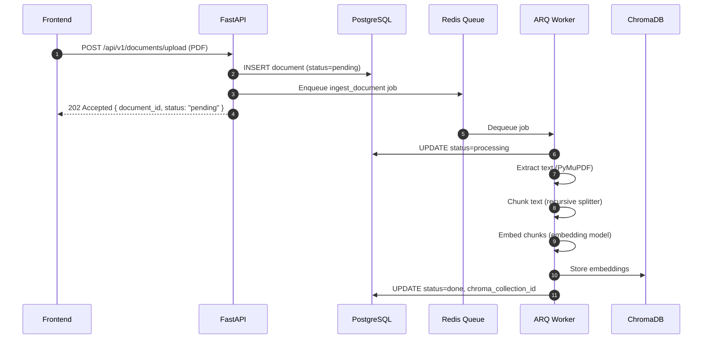

## Overview
<Callout type="abstract">
Accepts a PDF upload (10-K, 10-Q, fund fact sheet, SET report, etc.), stores file metadata, and queues an ingestion job. The worker extracts text, chunks it, embeds it, and stores in ChromaDB for RAG-based LLM analysis.
</Callout>

## 🔒 Authentication
- **Mechanism:** Bearer JWT

## 🛠️ Technical Specification

### Request
| Parameter | Location | Type | Required | Description |
| :--- | :--- | :--- | :--- | :--- |
| `Authorization` | Header | String | Yes | `Bearer {access_token}` |
| `Content-Type` | Header | String | Yes | `multipart/form-data` |
| `file` | Body | File | Yes | PDF file |
| `asset_id` | Body | UUID | Yes | Associated asset |
| `doc_type` | Body | String | Yes | `10k`, `10q`, `fund_fact`, `set_report`, `other` |

### Mermaid Logic



### 📤 Responses

**202 Accepted**
```json
{
  "document_id": "uuid",
  "filename": "AAPL-10K-2025.pdf",
  "status": "pending",
  "message": "Document queued for ingestion."
}
```

**400 Bad Request** — Not a PDF or missing fields

**401 Unauthorized**

### 🗂️ Related Files
| Role | Path |
| :--- | :--- |
| Router | `backend/app/api/documents.py` |
| Worker Job | `backend/worker/jobs/ingest_document.py` |
| Service | `backend/app/services/rag_service.py` |
