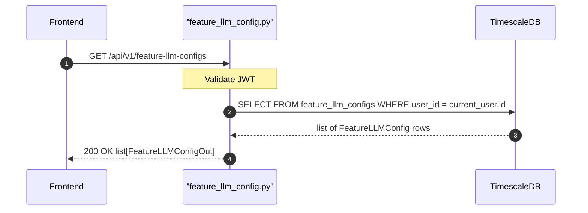

## Overview
Returns all Feature LLM Config records belonging to the authenticated user. Each record maps a product feature (e.g. `chat`, `analysis`) to a specific LLM provider config and model, along with its system prompt.

## 🔒 Authentication
| Field | Value |
| :--- | :--- |
| Required | Yes |
| Mechanism | JWT Bearer token via `get_current_user` |

## 🛠️ Technical Specification

### Request
| Field | Value |
| :--- | :--- |
| Method | `GET` |
| Path | `/api/v1/feature-llm-configs` |
| Path Params | — |
| Query Params | — |
| Request Body | — |

### Logic Flow


### 📤 Responses
| Status | Description | Body |
| :--- | :--- | :--- |
| 200 | Success | `list[FeatureLLMConfigOut]` |
| 401 | Missing or invalid JWT | `{"detail": "..."}` |

**FeatureLLMConfigOut shape:**
```json
[
  {
    "id": "uuid",
    "feature_key": "chat",
    "provider_config_id": "uuid",
    "model": "gpt-4o",
    "system_prompt": "...",
    "is_prompt_customized": false,
    "created_at": "2026-05-11T00:00:00Z",
    "updated_at": "2026-05-11T00:00:00Z"
  }
]
```

### 🗂️ Related Files
| Role | File |
| :--- | :--- |
| Router | `backend/app/api/feature_llm_config.py` |
| Schema | `backend/app/schemas/feature_llm_config.py` |
| Model | `backend/app/models/feature_llm_config.py` |
| Auth | `backend/app/api/auth.py` |


## 🗂️ Related
- [API-POST-v1-FeatureLLMConfig-Create](API-POST-v1-FeatureLLMConfig-Create)
- [API-PATCH-v1-FeatureLLMConfig-Update](API-PATCH-v1-FeatureLLMConfig-Update)
- [API-POST-v1-FeatureLLMConfig-ResetPrompt](API-POST-v1-FeatureLLMConfig-ResetPrompt)
