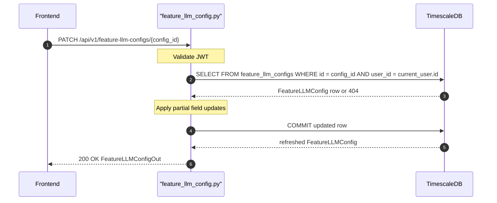

## Overview
Partially updates an existing Feature LLM Config owned by the authenticated user. Allows changing the linked provider config, the model, and/or the system prompt. If `system_prompt` is provided, `is_prompt_customized` is automatically set to `true`.

## 🔒 Authentication
| Field | Value |
| :--- | :--- |
| Required | Yes |
| Mechanism | JWT Bearer token via `get_current_user` |

## 🛠️ Technical Specification

### Request
| Field | Value |
| :--- | :--- |
| Method | `PATCH` |
| Path | `/api/v1/feature-llm-configs/{config_id}` |
| Content-Type | `application/json` |

**Path Parameters:**
| Param | Type | Description |
| :--- | :--- | :--- |
| `config_id` | `uuid` | ID of the FeatureLLMConfig to update |

**Request Body — `FeatureLLMConfigUpdate` (all fields optional):**
| Field | Type | Notes |
| :--- | :--- | :--- |
| `provider_config_id` | `uuid` | New provider config FK |
| `model` | `string` | New model identifier |
| `system_prompt` | `string` | Sets `is_prompt_customized = true` |

### Logic Flow

### 📤 Responses
| Status | Description | Body |
| :--- | :--- | :--- |
| 200 | Updated | `FeatureLLMConfigOut` |
| 401 | Missing or invalid JWT | `{"detail": "..."}` |
| 404 | Config not found or not owned | `{"detail": "Feature LLM config not found"}` |

### 🗂️ Related Files
| Role | File |
| :--- | :--- |
| Router | `backend/app/api/feature_llm_config.py` |
| Schema | `backend/app/schemas/feature_llm_config.py` |
| Model | `backend/app/models/feature_llm_config.py` |
| Auth | `backend/app/api/auth.py` |

## 🗂️ Related
- [API-GET-v1-FeatureLLMConfig-List](API-GET-v1-FeatureLLMConfig-List)
- [API-POST-v1-FeatureLLMConfig-Create](API-POST-v1-FeatureLLMConfig-Create)
- [API-POST-v1-FeatureLLMConfig-ResetPrompt](API-POST-v1-FeatureLLMConfig-ResetPrompt)
