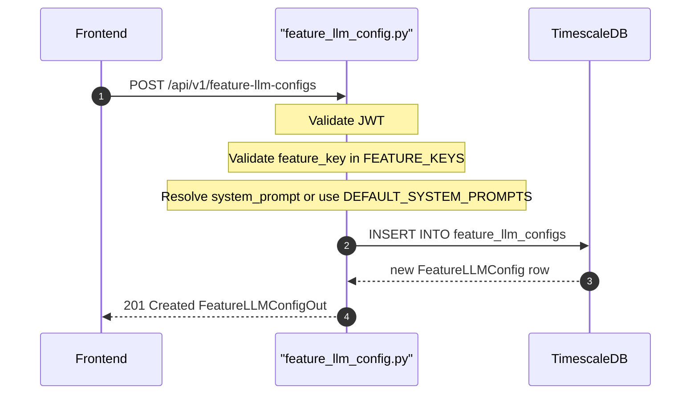

## Overview
Creates a new Feature LLM Config that binds a product feature key (e.g. `chat`, `analysis`) to a specific provider config and model. If no `system_prompt` is supplied, the platform default from `DEFAULT_SYSTEM_PROMPTS` is used and `is_prompt_customized` is set to `false`.

## 🔒 Authentication
| Field | Value |
| :--- | :--- |
| Required | Yes |
| Mechanism | JWT Bearer token via `get_current_user` |

## 🛠️ Technical Specification

### Request
| Field | Value |
| :--- | :--- |
| Method | `POST` |
| Path | `/api/v1/feature-llm-configs` |
| Path Params | — |
| Query Params | — |
| Content-Type | `application/json` |

**Request Body — `FeatureLLMConfigCreate`:**
| Field | Type | Required | Notes |
| :--- | :--- | :--- | :--- |
| `feature_key` | `string` | Yes | Must be in `FEATURE_KEYS` |
| `provider_config_id` | `uuid` | Yes | FK to ProviderConfig |
| `model` | `string` | Yes | Model identifier string |
| `system_prompt` | `string` | No | If omitted, default is used |

### Logic Flow

### 📤 Responses
| Status | Description | Body |
| :--- | :--- | :--- |
| 201 | Created | `FeatureLLMConfigOut` |
| 401 | Missing or invalid JWT | `{"detail": "..."}` |
| 422 | Unknown feature_key | `{"detail": "Unknown feature_key: ..."}` |

### 🗂️ Related Files
| Role | File |
| :--- | :--- |
| Router | `backend/app/api/feature_llm_config.py` |
| Schema | `backend/app/schemas/feature_llm_config.py` |
| Model | `backend/app/models/feature_llm_config.py` |
| Defaults | `backend/app/services/llm_gateway.py` (`DEFAULT_SYSTEM_PROMPTS`) |
| Auth | `backend/app/api/auth.py` |

## 🗂️ Related
- [API-GET-v1-FeatureLLMConfig-List](API-GET-v1-FeatureLLMConfig-List)
- [API-PATCH-v1-FeatureLLMConfig-Update](API-PATCH-v1-FeatureLLMConfig-Update)
- [API-POST-v1-FeatureLLMConfig-ResetPrompt](API-POST-v1-FeatureLLMConfig-ResetPrompt)
