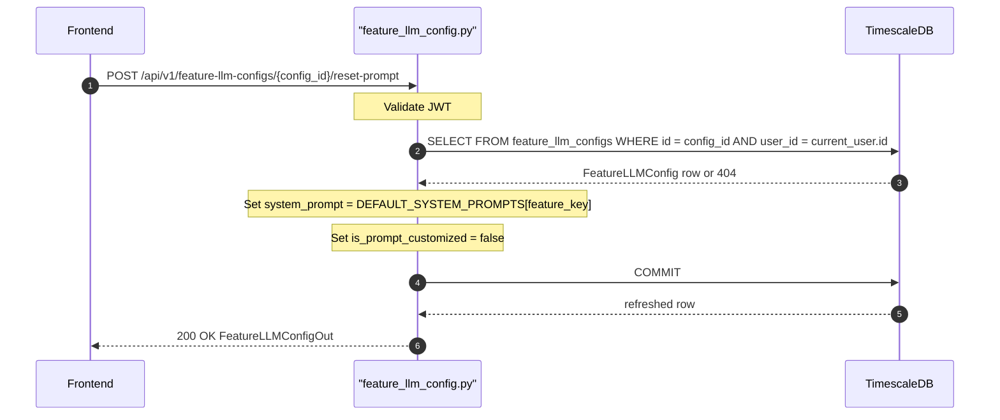

## Overview
Resets the system prompt of a Feature LLM Config back to the platform default for its `feature_key`. Sets `is_prompt_customized` to `false`. No request body required.

## 🔒 Authentication
| Field | Value |
| :--- | :--- |
| Required | Yes |
| Mechanism | JWT Bearer token via `get_current_user` |

## 🛠️ Technical Specification

### Request
| Field | Value |
| :--- | :--- |
| Method | `POST` |
| Path | `/api/v1/feature-llm-configs/{config_id}/reset-prompt` |
| Request Body | — (none) |

**Path Parameters:**
| Param | Type | Description |
| :--- | :--- | :--- |
| `config_id` | `uuid` | ID of the FeatureLLMConfig to reset |

### Logic Flow

### 📤 Responses
| Status | Description | Body |
| :--- | :--- | :--- |
| 200 | Reset successful | `FeatureLLMConfigOut` |
| 401 | Missing or invalid JWT | `{"detail": "..."}` |
| 404 | Config not found or not owned | `{"detail": "Feature LLM config not found"}` |

### 🗂️ Related Files
| Role | File |
| :--- | :--- |
| Router | `backend/app/api/feature_llm_config.py` |
| Schema | `backend/app/schemas/feature_llm_config.py` |
| Model | `backend/app/models/feature_llm_config.py` |
| Defaults | `backend/app/services/llm_gateway.py` (`DEFAULT_SYSTEM_PROMPTS`) |
| Auth | `backend/app/api/auth.py` |

## 🗂️ Related
- [API-GET-v1-FeatureLLMConfig-List](API-GET-v1-FeatureLLMConfig-List)
- [API-POST-v1-FeatureLLMConfig-Create](API-POST-v1-FeatureLLMConfig-Create)
- [API-PATCH-v1-FeatureLLMConfig-Update](API-PATCH-v1-FeatureLLMConfig-Update)
