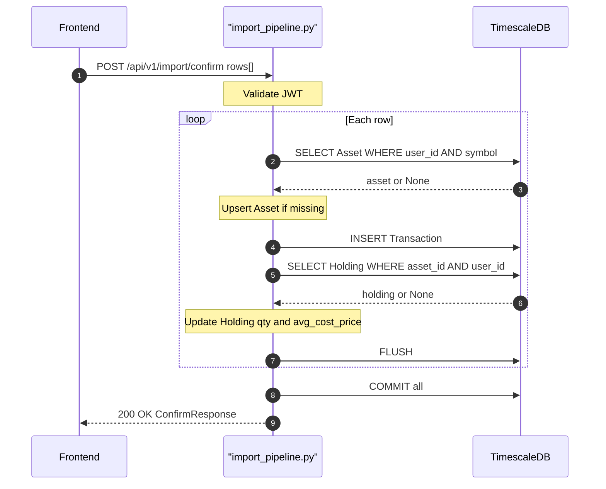

## Overview
Receives the reviewed rows from the upload step and commits them to the database. For each row it upserts the `Asset`, inserts a `Transaction`, and updates the `Holding` (weighted-average cost for buys; quantity reduction for sells; quantity addition for rewards). Rows that fail are collected in an `errors` list and do not roll back successful rows.

## 🔒 Authentication
| Field | Value |
| :--- | :--- |
| Required | Yes |
| Mechanism | JWT Bearer token via `get_current_user` |

## 🛠️ Technical Specification

### Request
| Field | Value |
| :--- | :--- |
| Method | `POST` |
| Path | `/api/v1/import/confirm` |
| Content-Type | `application/json` |

**Request Body — `ConfirmRequest`:**
| Field | Type | Required | Description |
| :--- | :--- | :--- | :--- |
| `rows` | `list[dict]` | Yes | Reviewed rows from upload response |

**Row field expectations:**
| Field | Notes |
| :--- | :--- |
| `symbol` | Required; uppercased |
| `type` | `buy` / `sell` / `reward` (default: `buy`) |
| `asset_type` | Default: `us_stock` |
| `currency` | Default: `THB` |
| `unit` | Quantity (Decimal) |
| `price` | Price per unit (Decimal) |
| `fee_thb` / `fee` | Fee (Decimal, optional) |
| `trade_date` | Parsed with `dateutil`; defaults to now if invalid |
| `platform` | Optional broker/platform name |

### Logic Flow


### 📤 Responses
| Status | Description | Body |
| :--- | :--- | :--- |
| 200 | Import complete | `ConfirmResponse` |
| 401 | Missing or invalid JWT | `{"detail": "..."}` |

**ConfirmResponse shape:**
```json
{
  "imported": 5,
  "errors": [
    {"row": {"symbol": "???"}, "error": "symbol is required"}
  ]
}
```

### 🗂️ Related Files
| Role | File |
| :--- | :--- |
| Router | `backend/app/api/import_pipeline.py` |
| Schema | `backend/app/schemas/import_pipeline.py` (`ConfirmRequest`, `ConfirmResponse`) |
| Models | `backend/app/models/asset.py`, `holding.py`, `transaction.py` |
| Auth | `backend/app/api/deps.py` |


## 🗂️ Related
- [API-POST-v1-Import-Upload](API-POST-v1-Import-Upload)
