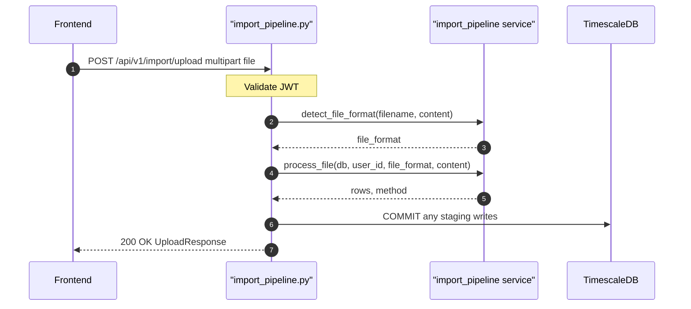

## Overview
Accepts a portfolio data file (CSV or other supported formats), detects its format, parses it into a preview row set, and returns the rows for user review before confirmation. Does not write transactions or holdings yet — use `/import/confirm` for the final commit.

## 🔒 Authentication
| Field | Value |
| :--- | :--- |
| Required | Yes |
| Mechanism | JWT Bearer token via `get_current_user` |

## 🛠️ Technical Specification

### Request
| Field | Value |
| :--- | :--- |
| Method | `POST` |
| Path | `/api/v1/import/upload` |
| Content-Type | `multipart/form-data` |

**Form Fields:**
| Field | Type | Required | Description |
| :--- | :--- | :--- | :--- |
| `file` | `UploadFile` | Yes | Portfolio data file (CSV etc.) |

### Logic Flow


### 📤 Responses
| Status | Description | Body |
| :--- | :--- | :--- |
| 200 | Parsed successfully | `UploadResponse` |
| 401 | Missing or invalid JWT | `{"detail": "..."}` |
| 422 | File could not be parsed | `{"detail": "<error message>"}` |

**UploadResponse shape:**
```json
{
  "rows": [{"symbol": "AAPL", "type": "buy", "unit": 10, "price": 150.0, "...": "..."}],
  "method": "csv_standard",
  "total": 1
}
```

### 🗂️ Related Files
| Role | File |
| :--- | :--- |
| Router | `backend/app/api/import_pipeline.py` |
| Service | `backend/app/services/import_pipeline.py` |
| Schema | `backend/app/schemas/import_pipeline.py` (`UploadResponse`) |
| Auth | `backend/app/api/deps.py` |


## 🗂️ Related
- [API-POST-v1-Import-Confirm](API-POST-v1-Import-Confirm)
