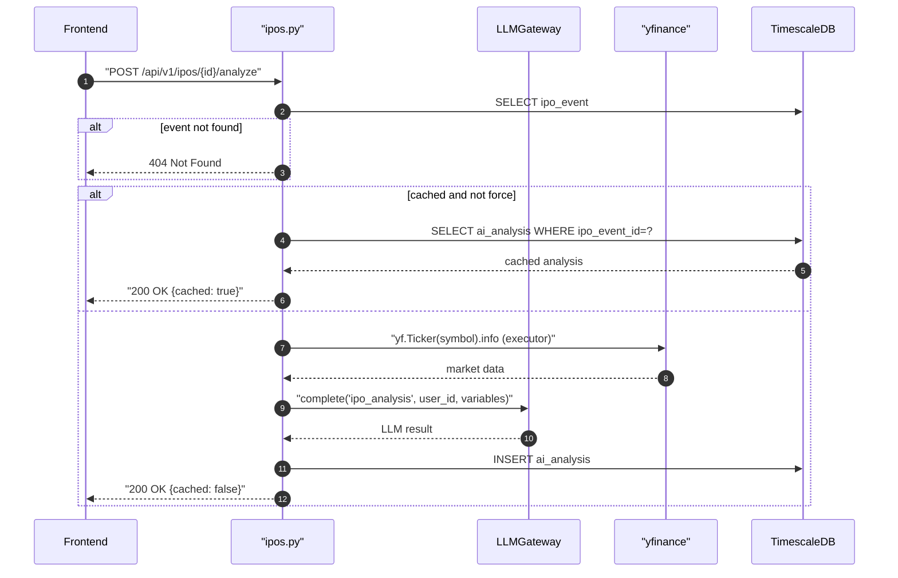

## Overview

Runs LLM analysis on an IPO event and returns a verdict (BUY/WATCH/SKIP), suggested price, and reasoning. Results are cached in `ai_analyses` and returned immediately on subsequent calls unless `force=true`.

## 🔒 Authentication

| Field | Value |
| :--- | :--- |
| Required | Yes |
| Mechanism | JWT Bearer token via `get_current_user` |

## 🛠️ Technical Specification

### Request

| Field | Value |
| :--- | :--- |
| Method | `POST` |
| Path | `/api/v1/ipos/{event_id}/analyze` |

| Path param | Type | Notes |
| :--- | :--- | :--- |
| `event_id` | UUID | IPO event to analyze |

| Query param | Type | Default | Notes |
| :--- | :--- | :--- | :--- |
| `force` | bool | `false` | Skip cache, force fresh LLM call |

### Logic Flow



### 📤 Responses

**200 OK**
```json
{
  "verdict": "BUY",
  "suggested_price": 25.50,
  "reasoning": "Strong fundamentals...",
  "provider": "openai",
  "model": "gpt-4o",
  "cached": false
}
```

**400 Bad Request** — LLM not configured for `ipo_analysis` feature key

**404 Not Found** — IPO event not found

**401 Unauthorized**

### 🗂️ Related Files

| Role | File |
| :--- | :--- |
| Router | `backend/app/api/ipos.py` |
| LLM Gateway | `backend/app/services/llm_gateway.py` |
| Model | `backend/app/models/ai_analysis.py` |
| External | `yfinance` library — fetches market cap, PE ratio, description |

## External Dependencies

- **[EXT-SEC-Thailand](EXT-SEC-Thailand)** — not used directly here; IPO data comes from `ipo_feed` service
- **yfinance** — enriches IPO data with live market info (`marketCap`, `trailingPE`, `longBusinessSummary`)


## 🗂️ Related

- [DB - ipo_events](/en/docs/zentri/database/db-ipo-events)
- [DB - ai_analyses](/en/docs/zentri/database/db-ai-analyses)
- [DB - llm_call_logs](/en/docs/zentri/database/db-llm-call-logs)
- [Page - Events](/en/docs/zentri/frontend/pages/page-events)
