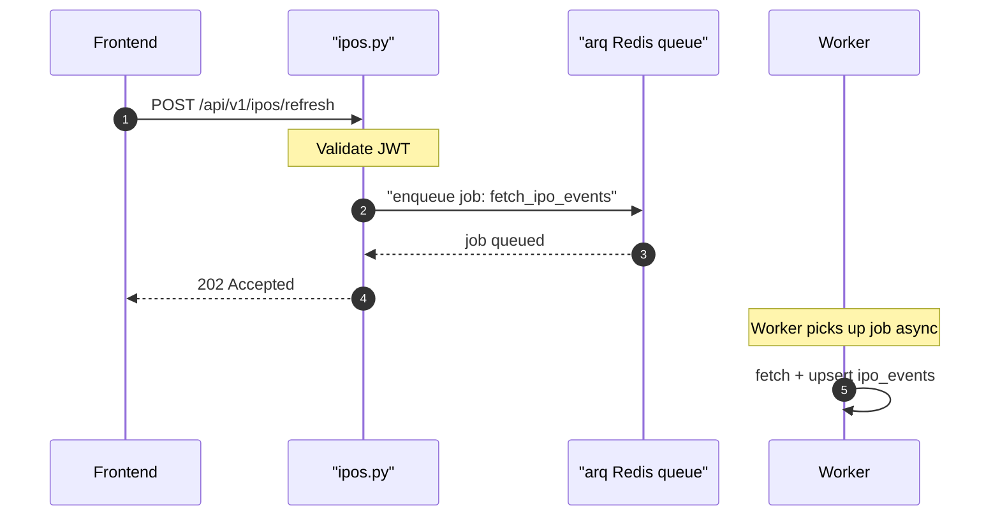

## Overview

Triggers an async refresh of IPO event data from external sources via the arq job queue. Returns 202 Accepted immediately — the actual fetch happens in the background worker.

## 🔒 Authentication

| Field | Value |
| :--- | :--- |
| Required | Yes |
| Mechanism | JWT Bearer token via `get_current_user` |

## 🛠️ Technical Specification

### Request

| Field | Value |
| :--- | :--- |
| Method | `POST` |
| Path | `/api/v1/ipos/refresh` |
| Request body | None |

### Logic Flow

### 📤 Responses

**202 Accepted** — job enqueued; refresh happens asynchronously

**401 Unauthorized**

### 🗂️ Related Files

| Role | File |
| :--- | :--- |
| Router | `backend/app/api/ipos.py` |
| Service | `backend/app/services/ipo_feed.py` |
| Worker | arq job queue via Redis |

## 🗂️ Related

- [DB - ipo_events](/en/docs/zentri/database/db-ipo-events)
- [API-POST-v1-IPOs-Analyze](API-POST-v1-IPOs-Analyze)
- [Page - Events](/en/docs/zentri/frontend/pages/page-events)
- [DevOps - Zentri](/en/docs/zentri/devops/devops-zentri)
