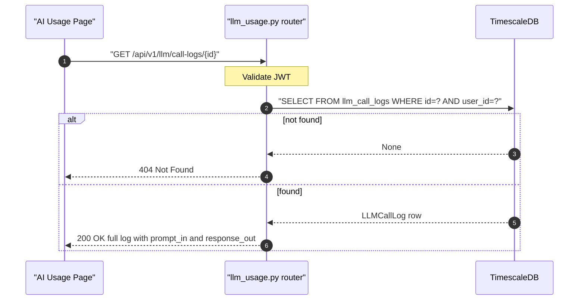

## Overview

Returns the full detail of a single LLM call log, including `prompt_in` and `response_out` (the raw LLM payload). Used by the AI Usage page payload viewer dialog.

---

## 🔒 Authentication

| Field | Value |
| :--- | :--- |
| Required | Yes |
| Mechanism | JWT Bearer token via `get_current_user` |
| Scope | User-scoped — returns 404 if log belongs to another user |

---

## 🛠️ Technical Specification

### Request

| Field | Value |
| :--- | :--- |
| Method | `GET` |
| Path | `/api/v1/llm/call-logs/{log_id}` |
| Request body | None |

| Path param | Type | Notes |
| :--- | :--- | :--- |
| `log_id` | UUID | Must belong to current user |

### Logic Flow



### 📤 Responses

**200 OK**
```json
{
  "id": "3fa85f64-...",
  "feature_key": "overview_analysis",
  "provider": "openai",
  "model": "gpt-4o",
  "tokens_in": 512,
  "tokens_out": 340,
  "cost_usd": 0.003412,
  "cost_thb": 0.118,
  "created_at": "2026-05-11T10:01:00Z",
  "prompt_in": "You are a financial analyst...",
  "response_out": "Your portfolio is..."
}
```

| Field | Type | Notes |
| :--- | :--- | :--- |
| All list fields | — | Same as `GET /llm/call-logs` items |
| `prompt_in` | string | Full prompt sent to LLM — may be large |
| `response_out` | string | Full LLM response |

**404 Not Found** — log not found or belongs to another user

**401 Unauthorized**

### 🗂️ Related Files

| Role | File |
| :--- | :--- |
| Router | `backend/app/api/llm_usage.py` → `get_call_log_detail()` |
| Model | `backend/app/models/llm_call_log.py` |
| Frontend caller | `frontend/app/(auth)/ai-usage/page.tsx` → `viewPayload(logId)` |

---


## 🗂️ Related

- [API - GET LLM Call Logs v1](/en/docs/zentri/api/llm/api-get-v1-llm-call-logs)
- [DB - llm_call_logs](/en/docs/zentri/database/db-llm-call-logs)
- [Page - AI Usage](Page - AI Usage)
