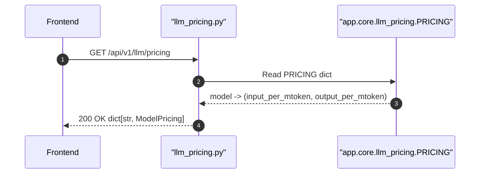

## Overview

Returns the pricing table for all known LLM models — input and output cost per million tokens in USD. Used by the frontend to display cost estimates and by `LLMGateway` to compute `cost_usd` after each call.

**Note: No authentication required.** This endpoint returns static public pricing data.

## 🔒 Authentication

| Field | Value |
| :--- | :--- |
| Required | **No** |
| Mechanism | None — public endpoint, no JWT check |

## 🛠️ Technical Specification

### Request

| Field | Value |
| :--- | :--- |
| Method | `GET` |
| Path | `/api/v1/llm/pricing` |
| Query params | None |

### Logic Flow



### 📤 Responses

**200 OK**
```json
{
  "gpt-4o": {
    "input_per_mtoken": 2.50,
    "output_per_mtoken": 10.00
  },
  "claude-3-5-sonnet-20241022": {
    "input_per_mtoken": 3.00,
    "output_per_mtoken": 15.00
  }
}
```

| Field | Type | Notes |
| :--- | :--- | :--- |
| Key | string | Model ID (e.g. `gpt-4o`) |
| `input_per_mtoken` | float | USD per million input tokens |
| `output_per_mtoken` | float | USD per million output tokens |

### 🗂️ Related Files

| Role | File |
| :--- | :--- |
| Router | `backend/app/api/llm_pricing.py` |
| Pricing table | `backend/app/core/llm_pricing.py` → `PRICING` dict |
| Frontend cache | `frontend/lib/llmPricing.ts` → `loadPricing()` |


## 🗂️ Related

- [DB - llm_call_logs](/en/docs/zentri/database/db-llm-call-logs)
- [API-GET-v1-LLM-Call-Logs](API-GET-v1-LLM-Call-Logs)
- [Page - Settings AI](/en/docs/zentri/frontend/pages/page-settings-ai)
