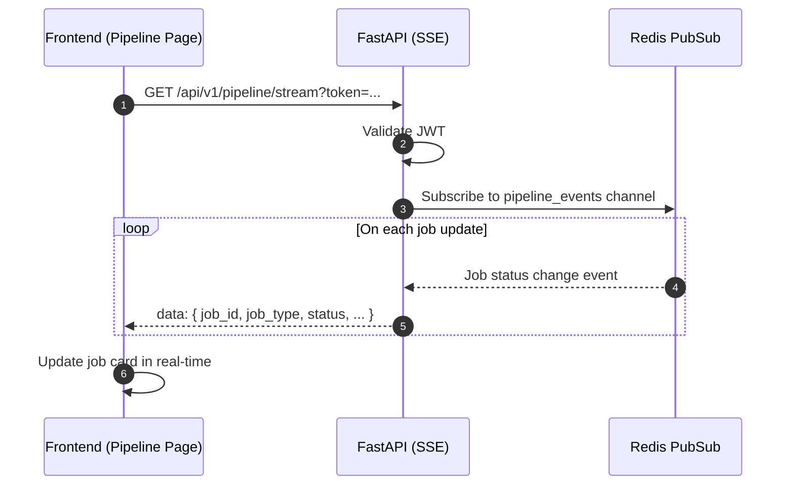

## Overview
<Callout type="abstract">
Server-Sent Events endpoint that pushes real-time pipeline job updates to the frontend. The Pipeline Monitor page subscribes once and receives pushed updates as jobs transition through queued → running → done/failed states. Eliminates polling.
</Callout>

## 🔒 Authentication
- **Mechanism:** Bearer JWT (passed as query param since EventSource doesn't support headers)

## 🛠️ Technical Specification

### Request
| Parameter | Location | Type | Required | Description |
| :--- | :--- | :--- | :--- | :--- |
| `token` | Query | String | Yes | JWT access token |

### Mermaid Logic



### 📤 SSE Event Format

```
data: {"job_id": "uuid", "job_type": "llm_analysis", "status": "running", "started_at": "2026-04-22T10:30:00Z"}

data: {"job_id": "uuid", "job_type": "llm_analysis", "status": "done", "finished_at": "2026-04-22T10:30:45Z"}

data: {"job_id": "uuid", "job_type": "price_fetch", "status": "failed", "error_message": "yfinance timeout"}
```

**401 Unauthorized** — Invalid or missing token

### 🗂️ Related Files
| Role | Path |
| :--- | :--- |
| Router | `backend/app/api/pipeline.py` |
| Worker | `backend/worker/jobs/*.py` (publishes events) |
