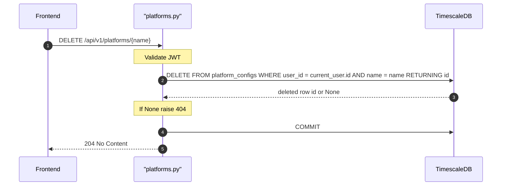

## Overview
Deletes the platform color configuration for the given platform name belonging to the authenticated user. Returns 404 if the named platform config does not exist for this user.

## 🔒 Authentication
| Field | Value |
| :--- | :--- |
| Required | Yes |
| Mechanism | JWT Bearer token via `get_current_user` |

## 🛠️ Technical Specification

### Request
| Field | Value |
| :--- | :--- |
| Method | `DELETE` |
| Path | `/api/v1/platforms/{name}` |
| Request Body | — |

**Path Parameters:**
| Param | Type | Description |
| :--- | :--- | :--- |
| `name` | `string` | Platform name to delete |

### Logic Flow

### 📤 Responses
| Status | Description | Body |
| :--- | :--- | :--- |
| 204 | Deleted | — |
| 401 | Missing or invalid JWT | `{"detail": "..."}` |
| 404 | Platform config not found | `{"detail": "Platform config not found"}` |

### 🗂️ Related Files
| Role | File |
| :--- | :--- |
| Router | `backend/app/api/platforms.py` |
| Model | `backend/app/models/platform_config.py` |
| Auth | `backend/app/api/deps.py` |

## 🗂️ Related
- [API-GET-v1-Platforms-List](API-GET-v1-Platforms-List)
- [API-PUT-v1-Platforms-Upsert](API-PUT-v1-Platforms-Upsert)
